# Lab 01 — Independent Lab Exercises

## Exercise 1 — The QA identity

I created a group usms-qa and a user usms-qa-01 inside it, tagged with Role=QA and Project=USMS. I attached the existing USMSDeveloperBase policy to the group instead of the user, capturing the user's ARN into a variable the same way I did in Step 19.

```bash
aws iam create-group --group-name usms-qa

QA_ARN=$(aws iam create-user \
  --user-name usms-qa-01 \
  --tags Key=Role,Value=QA Key=Project,Value=USMS \
  --query 'User.Arn' \
  --output text)

aws iam add-user-to-group --group-name usms-qa --user-name usms-qa-01

aws iam attach-group-policy \
  --group-name usms-qa \
  --policy-arn "$USMS_POLICY_DEV_BASE"
```


```bash
aws iam get-group --group-name usms-qa
aws iam list-attached-group-policies --group-name usms-qa
aws iam list-attached-user-policies --user-name usms-qa-01
```


get-group shows usms-qa-01 inside the group, the group has USMSDeveloperBase attached, and the user's own attached-policies list is empty. Permissions only reach the user through the group.

## Exercise 2 — The read-only reporting policy

I wrote a customer managed policy USMSReportingReadOnly with three statements: s3:ListBucket on the bucket itself, s3:GetObject scoped to arn:aws:s3:::usms-student-data/transcripts/*, and an explicit Deny on s3:Put* and s3:Delete* covering both the bucket and the objects inside it.

```bash
aws iam create-policy \
  --policy-name USMSReportingReadOnly \
  --description "Read-only access to transcripts prefix; explicit deny on writes and deletes" \
  --policy-document file://usms-reporting-readonly-policy.json \
  --query 'Policy.Arn' \
  --output text
```


I validated the JSON with py -m json.tool since python3 isn't available on my system, but py works.


Policy created with ARN arn:aws:iam::000000000000:policy/USMSReportingReadOnly.


Checked with the lab's expected outcome command, it confirms the policy exists with DefaultVersionId v1 and AttachmentCount 0, since this exercise only asked me to create it, not attach it anywhere.

## Exercise 3 — Problem solving: the third-party analytics role

I designed usms-analytics-partner-role for a partner university's analytics service. It can only be assumed by usms-audit-01, needs a session of at most 30 minutes, and can only read objects under the reports/ prefix. I kept the trust policy and the permissions policy in two separate files as the exercise asked: trust-analytics-partner.json names usms-audit-01 as the trusted principal, and usms-analytics-partner-permissions.json allows s3:GetObject scoped to arn:aws:s3:::usms-student-data/reports/*.

AWS does not let MaxSessionDuration go below 3600 seconds when creating a role, so I created the role with the minimum allowed ceiling and instead asked for the actual 30 minute credential using --duration-seconds 1800 on the assume-role call itself.

```bash
aws iam create-role \
  --role-name usms-analytics-partner-role \
  --description "Read-only access to reports for partner analytics, assumed by usms-audit-01" \
  --assume-role-policy-document file://trust-analytics-partner.json \
  --max-session-duration 3600 \
  --tags Key=Project,Value=USMS Key=External,Value=true \
  --query 'Role.Arn' \
  --output text

aws iam create-policy \
  --policy-name USMSAnalyticsPartnerReports \
  --policy-document file://usms-analytics-partner-permissions.json \
  --query 'Policy.Arn' \
  --output text

aws iam attach-role-policy \
  --role-name usms-analytics-partner-role \
  --policy-arn "$ANALYTICS_POLICY_ARN"
```

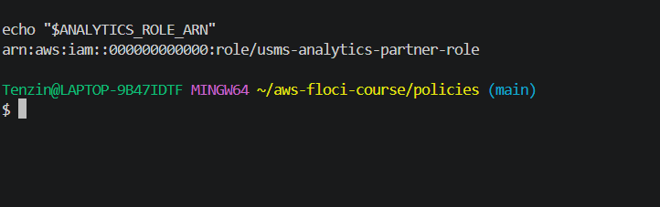

```bash
aws iam get-role --role-name usms-analytics-partner-role \
  --query 'Role.{MaxSession:MaxSessionDuration,Trust:AssumeRolePolicyDocument.Statement[0].Principal}' \
  --output json

aws iam list-attached-role-policies --role-name usms-analytics-partner-role
```

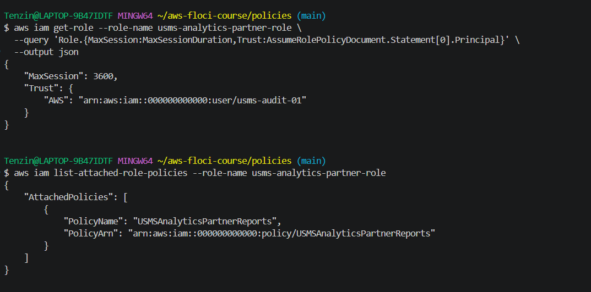

MaxSessionDuration is 3600, the trust policy names usms-audit-01, and USMSAnalyticsPartnerReports is attached.

```bash
aws sts assume-role \
  --role-arn "$ANALYTICS_ROLE_ARN" \
  --role-session-name usms-audit-01-analytics \
  --duration-seconds 1800 \
  --profile floci
```

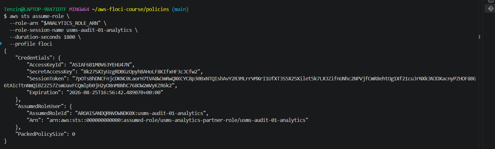

Expiration came back as 2026-08-25T16:56:42, exactly 30 minutes after the call, so the duration worked as intended. I called assume-role from my normal floci profile rather than actually being usms-audit-01, same shortcut Lab 1 Step 30 used, since Floci doesn't enforce who is allowed to assume a role.

On sts:ExternalId, I would add one for a real external partner. Without it, anything that discovers the role ARN and holds usms-audit-01's credentials could assume it. An ExternalId is a shared secret the partner must also supply, protecting against the confused deputy problem where a third party gets tricked into assuming a role on someone else's behalf.

## Exercise 4 — Challenge: design a least-privilege policy from a job description

I designed permissions for a nightly backup job that copies everything from the student data bucket into an archive bucket, verifies what it copied, and writes a completion log to CloudWatch. It must never delete anything, never read IAM, and only ever run in us-east-1.

I chose a role over a user or group since this is an automated job, not a person, same reasoning as usms-ec2-app-role. Full justification is in notes/lab-01-notes.md.

The policy has 4 statements, within the exercise's limit. The first two handle reading the source bucket and reading/writing/verifying the archive bucket, both locked to us-east-1 with a Condition. The third handles logging, scoped to one specific log group rather than all logs. The fourth is an explicit Deny on delete actions and all IAM actions, which uses Resource *, but the exercise only forbids wildcards on Allow statements.

```bash
aws iam create-role \
  --role-name usms-backup-operator-role \
  --description "Nightly backup job: copies student data to archive, verifies, logs completion" \
  --assume-role-policy-document file://trust-backup-operator.json \
  --tags Key=Project,Value=USMS \
  --query 'Role.Arn' \
  --output text

aws iam create-policy \
  --policy-name USMSBackupOperator \
  --policy-document file://usms-backup-operator-policy.json \
  --query 'Policy.Arn' \
  --output text

aws iam attach-role-policy \
  --role-name usms-backup-operator-role \
  --policy-arn "$BACKUP_POLICY_ARN"
```

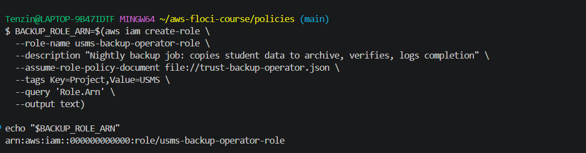

Role created with a trust policy for ec2.amazonaws.com, same pattern as Step 28.

```bash
aws iam get-role --role-name usms-backup-operator-role \
  --query 'Role.{Name:RoleName,Trust:AssumeRolePolicyDocument.Statement[0].Principal}' \
  --output json

aws iam list-attached-role-policies --role-name usms-backup-operator-role
```

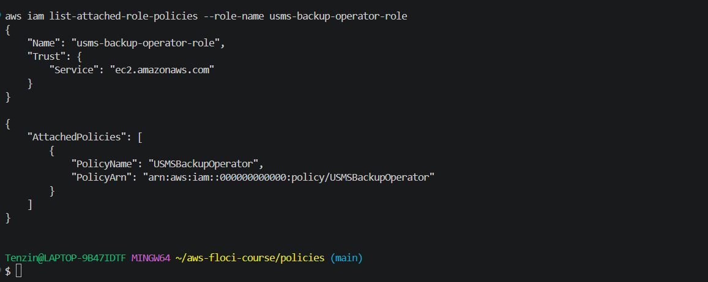

Confirms the trust policy names ec2.amazonaws.com and USMSBackupOperator is attached.

```bash
aws iam get-policy-version \
  --policy-arn "$BACKUP_POLICY_ARN" \
  --version-id "$VER" \
  --query 'PolicyVersion.Document.Statement[*].Condition'
```

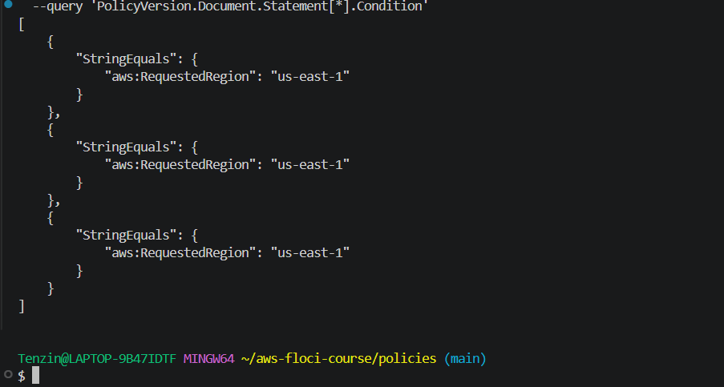

All three Allow statements carry the aws:RequestedRegion condition locking them to us-east-1.

The three ways this policy could still be abused, and how I would close each gap, are written up in notes/lab-01-notes.md.

## Exercise 5 — Integration: prepare the identity Lab 2 will use

I checked whether usms-dev-01 already has every EC2 and VPC permission Lab 2 needs, and added whatever was missing as a new version of USMSDeveloperBase.

I read the current v2 policy and compared its BuildNetworkingForLab02 statement against the 11 actions the exercise listed. Two were missing: ec2:CreateNatGateway and ec2:AllocateAddress.

```bash
aws iam get-policy-version \
  --policy-arn "$POLICY_ARN" \
  --version-id v2 \
  --query 'PolicyVersion.Document.Statement[?Sid==`BuildNetworkingForLab02`].Action' \
  --output json
```

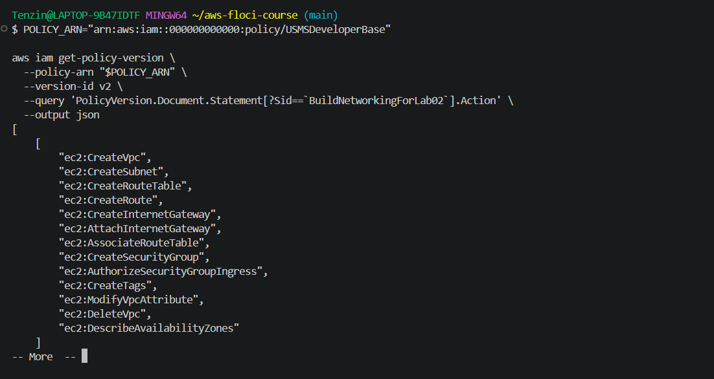

v2 already had CreateVpc, CreateSubnet, CreateRouteTable, CreateRoute, CreateInternetGateway, AttachInternetGateway, AssociateRouteTable, ModifyVpcAttribute, and DescribeAvailabilityZones, but not the two missing ones. Both are needed for Lab 2's NAT gateway step, since a NAT gateway needs an Elastic IP allocated to it first.

I saved the v2 document to a new file, added the two missing actions to the same statement, and validated the JSON.

```bash
py -m json.tool usms-developer-base-policy-v3.json
```

Then created it as version 3 with create-policy-version, not by deleting and recreating the policy.

```bash
aws iam create-policy-version \
  --policy-arn "$POLICY_ARN" \
  --policy-document file://usms-developer-base-policy-v3.json \
  --set-as-default
```

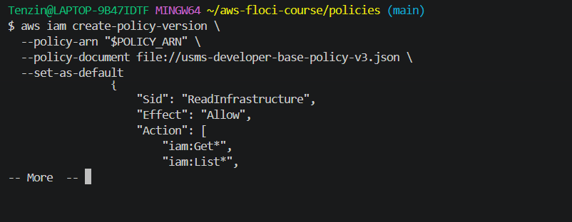

Checked that all three versions still exist and v3 is now default.

```bash
aws iam list-policy-versions \
  --policy-arn "$POLICY_ARN" \
  --query 'Versions[*].{Version:VersionId,Default:IsDefaultVersion,Created:CreateDate}' \
  --output table
```

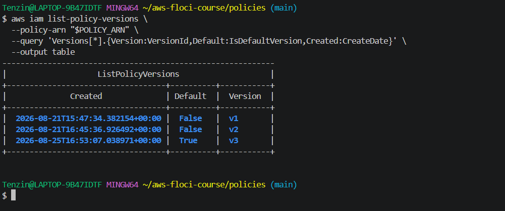

Matches the expected outcome, v1 and v2 both show False, v3 shows True.

I extended configs/lab-01.env with USMS_VPC_CIDR=10.0.0.0/16 so Lab 2 can source it directly.

```bash
echo 'export USMS_VPC_CIDR=10.0.0.0/16' >> configs/lab-01.env
```

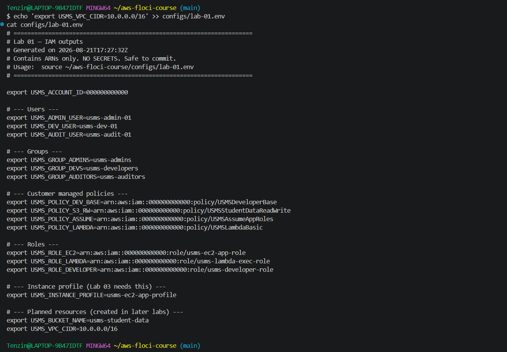

The exercise also pointed out that verify-lab-01.sh checks the default version is v2, and would fail after this change unless updated. I found scripts/utilities/verify-lab-01.sh had never actually been filled in, it was an empty file, so I wrote the full script from Section 5 of the lab instructions and changed that one check from v2 to v3 as instructed. It now runs clean.

```bash
./scripts/utilities/verify-lab-01.sh
```

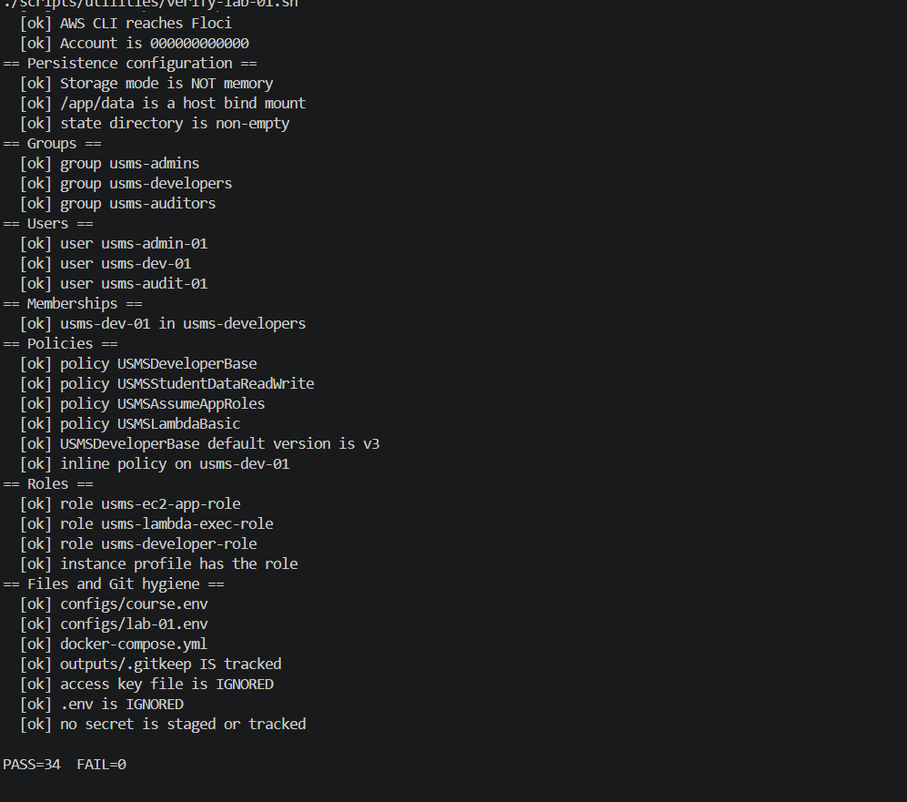