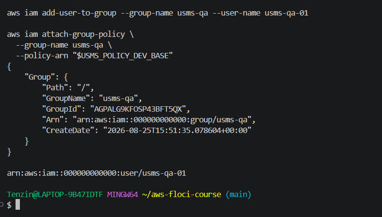
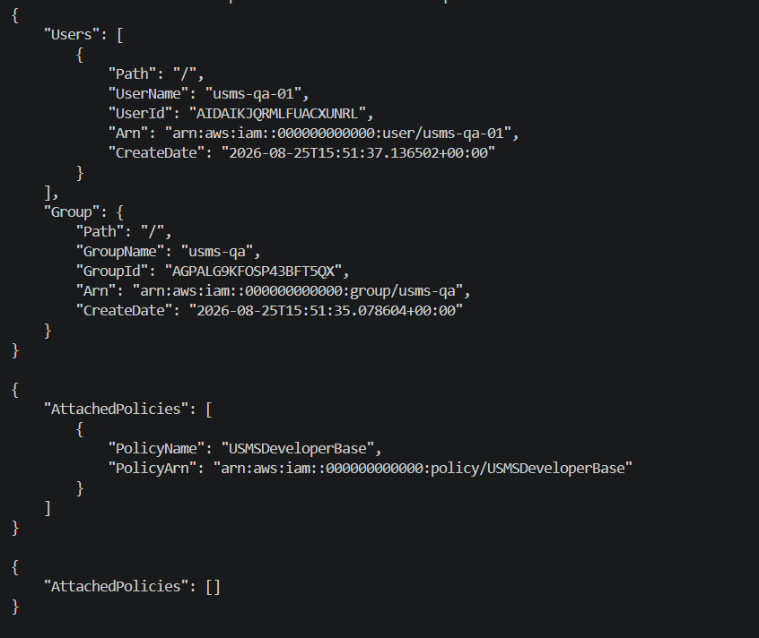
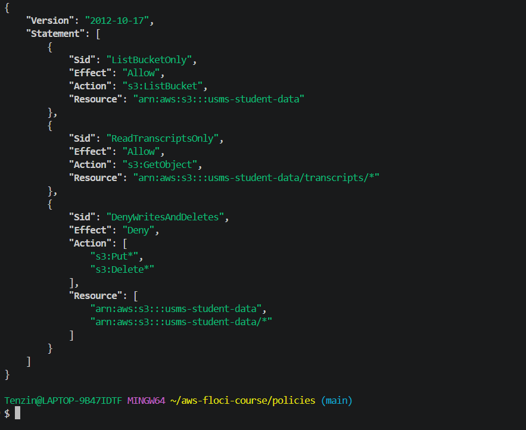
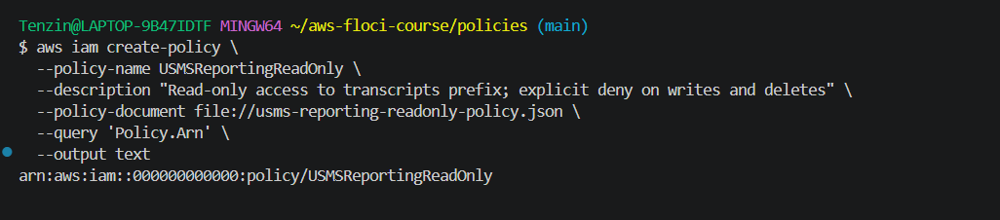
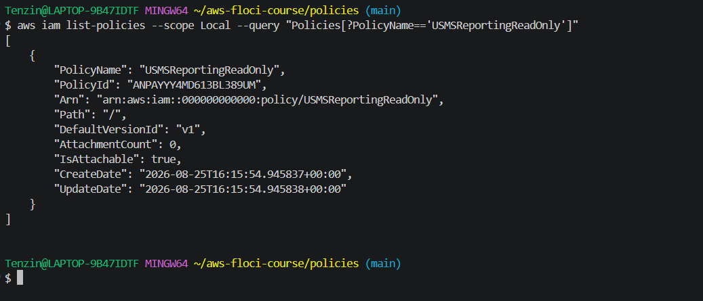

# Lab 01 — Independent Lab Exercises

## Exercise 1 — The QA identity

For this exercise I had to create a new group called usms-qa and a user usms-qa-01 inside it, then attach the existing USMSDeveloperBase policy to the group instead of making a new one.

I created the group first, then made the user with tags Role=QA and Project=USMS, capturing the user's ARN into a variable the same way I did back in Step 19. After that I added the user to the group and attached USMSDeveloperBase to the group, not directly to the user.

```bash
aws iam create-group --group-name usms-qa

QA_ARN=$(aws iam create-user \
  --user-name usms-qa-01 \
  --tags Key=Role,Value=QA Key=Project,Value=USMS \
  --query 'User.Arn' \
  --output text)

aws iam add-user-to-group --group-name usms-qa --user-name usms-qa-01

aws iam attach-group-policy \
  --group-name usms-qa \
  --policy-arn "$USMS_POLICY_DEV_BASE"
```



Group and user got created fine and the ARN was captured correctly.

Then I ran the three verify commands from the lab to check everything worked.

```bash
aws iam get-group --group-name usms-qa
aws iam list-attached-group-policies --group-name usms-qa
aws iam list-attached-user-policies --user-name usms-qa-01
```



get-group shows usms-qa-01 is inside the group, list-attached-group-policies shows USMSDeveloperBase is attached to the group, and list-attached-user-policies on the user comes back empty. That confirms no policy is attached directly to the user, it only comes through the group.

## Exercise 2 — The read-only reporting policy

For this exercise I had to write a new customer managed policy called USMSReportingReadOnly that only lets someone list the bucket and read objects under the transcripts/ prefix, and explicitly denies any Put or Delete action on the bucket.

I wrote the policy with three statements. One allows s3:ListBucket on the bucket itself, one allows s3:GetObject scoped to arn:aws:s3:::usms-student-data/transcripts/*, and the last one is an explicit Deny on s3:Put* and s3:Delete* covering both the bucket and the objects inside it.

```bash
aws iam create-policy \
  --policy-name USMSReportingReadOnly \
  --description "Read-only access to transcripts prefix; explicit deny on writes and deletes" \
  --policy-document file://usms-reporting-readonly-policy.json \
  --query 'Policy.Arn' \
  --output text
```



I validated the JSON with py -m json.tool before creating the policy since python3 doesn't work on my system, but py does.



Policy got created with the ARN arn:aws:iam::000000000000:policy/USMSReportingReadOnly.



I checked it with the same command the lab gave as the expected outcome, and it confirms the policy exists with DefaultVersionId v1 and AttachmentCount 0, since the exercise only asked me to create it, not attach it anywhere yet.