# Lab 1 — Identity and Access Management (IAM)

## 1. Aim / Objective

The aim of this lab was to set up a local AWS environment using Floci, install and configure the AWS CLI, and build the complete IAM foundation (users, groups, policies, and roles) required for the University Student Management System (USMS) project.

## 2. Introduction

AWS Identity and Access Management (IAM) is the service that controls who can access AWS resources and what actions they are allowed to perform. IAM lets me create users, group them by role, and attach policies that define permissions in a structured, auditable way. Key features include users, groups, roles, and policies (AWS managed, customer managed, and inline), along with mechanisms like trust policies for roles and temporary credentials through STS. IAM is important because it enforces the principle of least privilege, meaning every identity only gets the permissions it actually needs, which reduces the risk of accidental or malicious damage. In real world cloud environments, IAM is the first layer of security applied before any other service is even touched.

## 3. Use Case

- Restricting a junior developer to only the resources they need for their project, not the entire AWS account
- Giving an EC2 instance temporary, auto rotating credentials through a role instead of storing permanent keys on the server
- Allowing an auditor read only access across the account so they can review resources without being able to change anything
- Letting a third party service temporarily assume a role to access specific data for a limited time

## 4. System Architecture / Design

For this lab, I used Floci, a local AWS emulator that runs inside Docker and is managed with Docker Compose. My AWS CLI sends commands to Floci at `http://localhost:4566`, and Floci saves all IAM data to `~/floci-data` on my computer using `FLOCI_STORAGE_MODE=hybrid`, so the data stays even after a restart.

I built 3 groups, 3 users, 4 customer managed policies, 1 inline policy, and 3 roles for different purposes such as EC2, Lambda, and temporary developer access.

## 5. Implementation Procedure

### Part A — Environment Setup

I created the full project directory structure first, before starting any service, so the configuration would be committed from the very first run. I wrote `.gitignore` and initialised Git before creating any secret, then proved the ignore rules worked by creating a fake secret file and confirming Git blocked it.

I learned that Floci defaults to `memory` storage mode, meaning all data is lost on restart. I configured `docker-compose.yml` and `configs/course.env` with `FLOCI_STORAGE_MODE=hybrid` and an absolute bind mount path, then wrote `floci-up.sh` and `floci-down.sh` scripts to start and stop the environment safely.

I installed AWS CLI v2 and created a profile named `floci` pointing at `http://localhost:4566`. I proved isolation from real AWS three ways: checking the account number was `000000000000`, inspecting the actual request URL with `--debug`, and confirming that stopping Floci broke the CLI. I then proved persistence by creating a test user, fully restarting the container, and confirming the user still existed afterward.

### Part B — Building the IAM Foundation

I created 3 IAM groups and 3 users, placed each user in the correct group, and attached an AWS managed `ReadOnlyAccess` policy to the auditors group.

I wrote a customer managed policy called `USMSDeveloperBase` with three statements: one allowing broad read access, one allowing specific EC2 networking actions scoped to `us-east-1`, and one explicit `Deny` blocking dangerous identity changes like creating users or attaching policies. I attached this policy to both the developers and admins groups.

I wrote a second customer managed policy, `USMSStudentDataReadWrite`, correctly separating the bucket level ARN (for `ListBucket`) from the object level ARN with a trailing `/*` (for `GetObject`/`PutObject`), since these are two different permission scopes in S3.

I added an inline policy to `usms-dev-01` allowing self service credential management, using the `${aws:username}` policy variable so the same document works for any user without hardcoding a name.

I created three roles: `usms-ec2-app-role` (trusted by the EC2 service, for the application server), `usms-lambda-exec-role` (trusted by Lambda, for notification functions), and `usms-developer-role` (trusted by `usms-dev-01` directly, for temporary elevated access). For the EC2 role, I also created an instance profile and attached the role to it, since EC2 instances cannot be given a role directly.

I demonstrated the STS assume role workflow: I gave the developers group permission to call `sts:AssumeRole`, then assumed `usms-developer-role` to obtain temporary credentials, identifiable by the `ASIA` prefix instead of the permanent `AKIA` prefix. I used those credentials to confirm my identity had changed, then reverted back to my normal identity.

Finally, I created a real access key for `usms-dev-01`, redirected the output directly into a file so the secret never appeared on screen, and confirmed Git's ignore rules correctly protected that file from being committed.

## 6. Results and Evidence

### 6.1 CLI / SDK Evidence

**Screenshot 1 — Environment running**
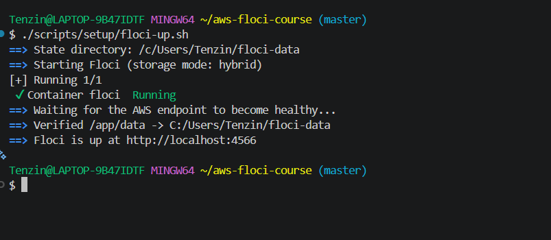
Floci container healthy, hybrid storage mode confirmed.
Image Source: N/A

**Screenshot 2 — CLI connected to Floci**
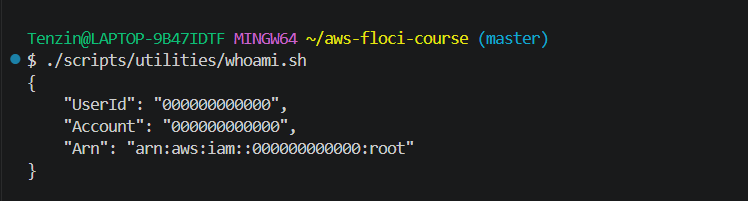
AWS CLI successfully reaching Floci, showing account 000000000000.
Image Source: N/A

**Screenshot 3 — Persistence proven**
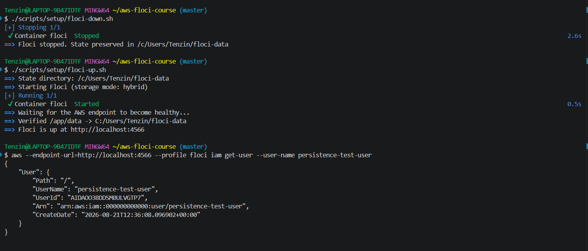
Test user survived a full container restart, confirming hybrid storage works.
Image Source: N/A

**Screenshot 4 — Groups created**
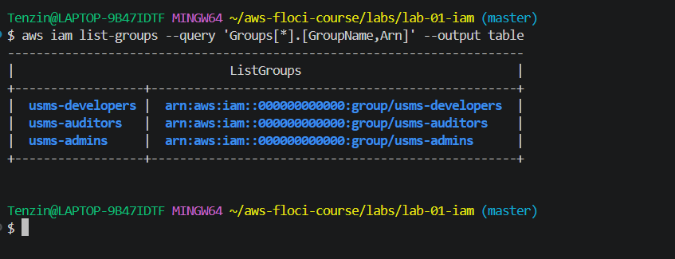
usms-admins, usms-developers, usms-auditors created and verified.
Image Source: N/A

**Screenshot 5 — Users created**
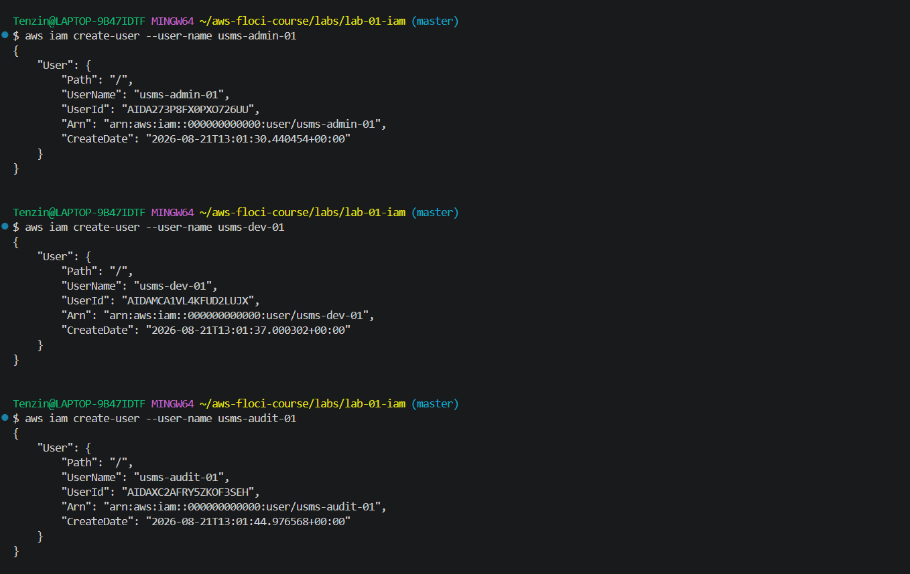
usms-admin-01, usms-dev-01, usms-audit-01 created with correct ARNs.
Image Source: N/A

**Screenshot 6 — Developer policy attached**
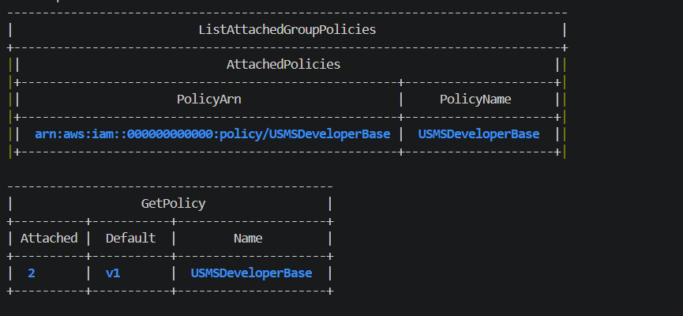
USMSDeveloperBase attached to both usms-developers and usms-admins.
Image Source: N/A

**Screenshot 7 — S3 policy created**
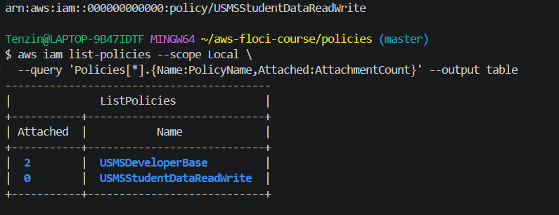
USMSStudentDataReadWrite created with correct bucket and object ARNs.
Image Source: N/A

**Screenshot 8 — Inline vs attached policy**
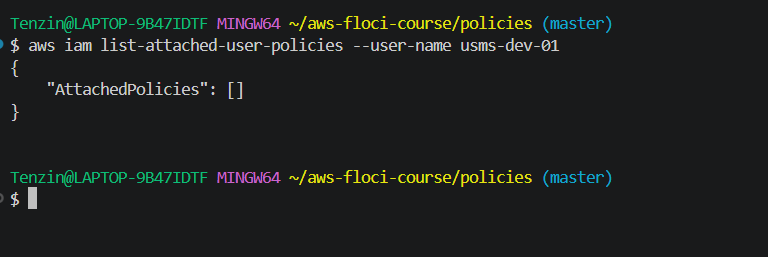
Shows inline policy listed separately from attached policies.
Image Source: N/A

**Screenshot 9 — EC2 role verified**
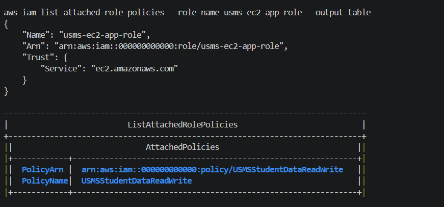
usms-ec2-app-role with correct trust principal and attached policy.
Image Source: N/A

**Screenshot 10 — Temporary credentials**
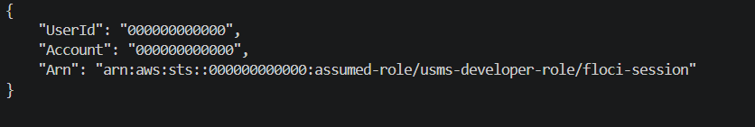
Identity changed to assumed role ARN after sts assume-role.
Image Source: N/A

**Screenshot 11 — Secret protected**
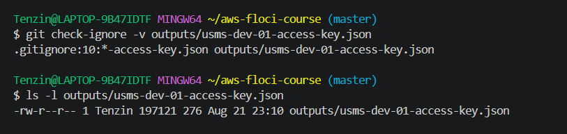
Git correctly ignoring the real access key file.
Image Source: N/A

### 6.2 Verification Summary

- Environment: Floci running via Docker Compose, hybrid storage, persistence proven
- 3 groups, 3 users, correct memberships
- 4 customer managed policies + 1 inline policy
- 3 roles with correct trust policies + 1 instance profile
- Temporary credentials obtained and used via STS
- Secret access key created and protected by `.gitignore`
- All work committed to Git with `.gitignore` as the first commit

**Screenshot 12 — Final commit history**
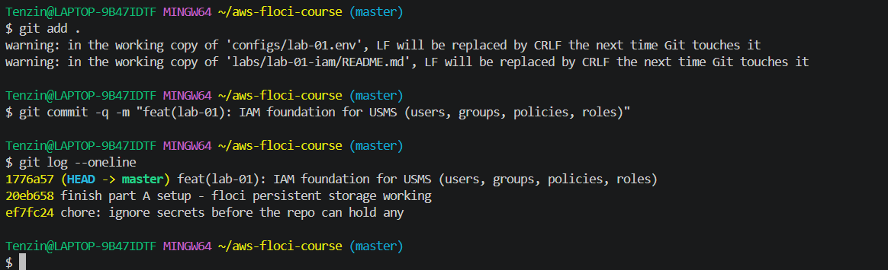
Three commits in order, with .gitignore as the oldest commit.
Image Source: N/A

## 7. Analysis and Discussion

I achieved every objective in this lab. I built a fully working local AWS environment and a complete IAM identity structure, and got hands on experience with the same CLI commands and policy documents used in real AWS accounts.

I ran into several real problems along the way. My Floci CLI download kept getting corrupted over my regular network connection, giving a different, invalid file size each time. Switching to a mobile hotspot fixed it. My AWS CLI could not reach Floci at first because the endpoint_url setting was missing from my profile, which I found by checking the config file directly. I also found that PowerShell cannot run .sh scripts at all, so I had to do all script based work in Git Bash instead. When one step needed a Python script to edit a policy file, I found Python was not properly installed, so I got the same result by editing the JSON file by hand. I also noticed that chmod 600 has no real effect on Windows, since its filesystem does not use the same permission system as Linux.

One thing I noticed while testing is that Floci does not fully enforce IAM policies. When I ran the policy simulator, it allowed a write action for a user that only had read only access, which should never happen on real AWS. This showed me that a command succeeding in Floci does not always mean the policy itself is correct, so I need to actually read and check the policy JSON rather than just trust that it worked.

## 8. Reflection

**What did I learn about this AWS service?**
I learned that IAM works by separating identities (users, groups, roles) from permissions (policies). Permissions should go on groups and roles, not directly on users. I also learned that a role needs two separate things to work: a trust policy (who can use it) and a permissions policy (what it can do).

**What challenges did I encounter?**
Most of my challenges were about the environment, not IAM itself. Getting Floci and AWS CLI to talk to each other on Windows took a while, and I also had download and installation problems along the way.

**How would I apply this service in a real world cloud environment?**
I would give permissions to groups instead of individual users, use roles instead of permanent access keys for servers, and always add a Deny rule for anything that should never be allowed.

**What additional concepts would I like to explore?**
I would like to learn more about permission boundaries and CloudTrail, since this lab only covered them as concepts without letting me actually use them in Floci.

## 9. Conclusion

This lab helped me build the complete IAM setup for the USMS project. I created three groups, three users, four managed policies, one inline policy, and three roles with the correct trust relationships. I also set up a local AWS environment that actually keeps its data after a restart, which future labs will depend on. Along the way, I also learned a lot about troubleshooting real problems on Windows, like fixing broken downloads, missing tools, and permission differences between operating systems.

## 10. Appendix (Optional)

- GitHub repository: https://github.com/Eyemusican/dso303-lab01-iam
- Policy files: `policies/` directory in the repository
- Scripts: `scripts/setup/`, `scripts/utilities/`, `scripts/cleanup/`
- Lab notes: `labs/lab-01-iam/lab-01-notes.md`