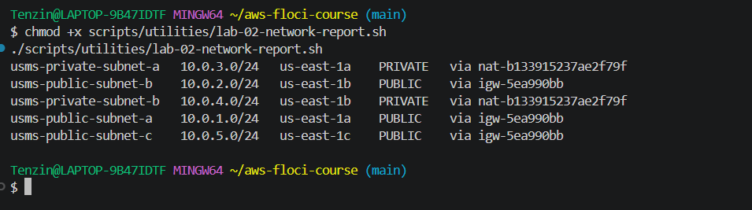
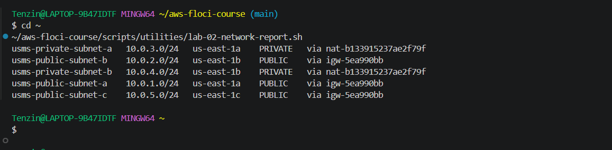
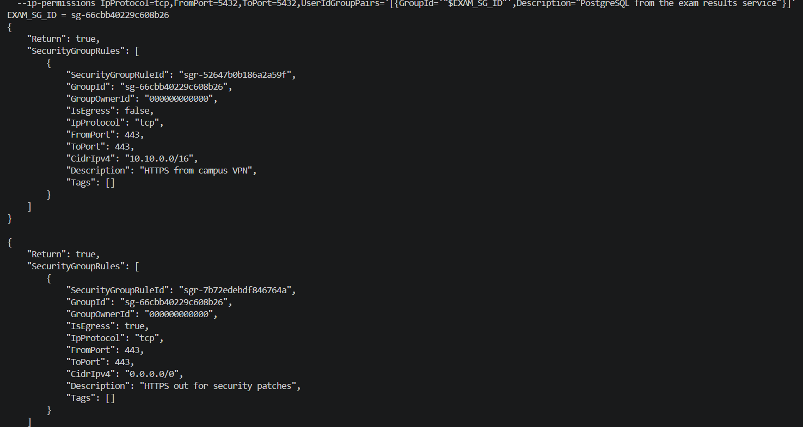
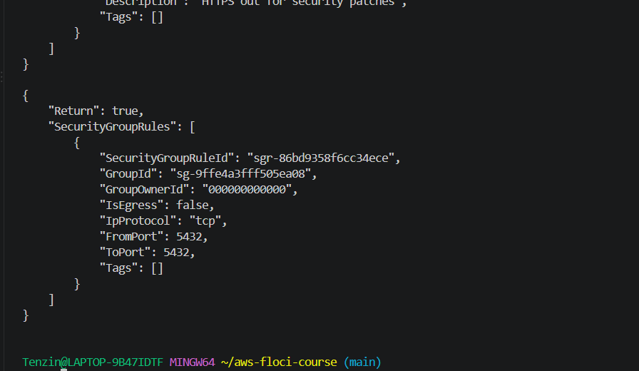

# Lab 02: Independent Lab Exercises

## Exercise 1: Basic, a third public subnet

I created usms-public-subnet-c in us-east-1c with CIDR 10.0.5.0/24, tagged the same way as the other subnets, turned on auto-assign public IP, and associated it with usms-public-rt. Same pattern as Steps 7, 8, and 11, just a different AZ and CIDR.

```bash
PUBLIC_SUBNET_C_ID=$(aws ec2 create-subnet \
  --vpc-id "$VPC_ID" \
  --cidr-block 10.0.5.0/24 \
  --availability-zone "${AWS_REGION_COURSE}c" \
  --tag-specifications 'ResourceType=subnet,Tags=[{Key=Name,Value=usms-public-subnet-c},{Key=Project,Value=USMS},{Key=Tier,Value=public},{Key=AZ,Value=c}]' \
  --query 'Subnet.SubnetId' \
  --output text)

aws ec2 modify-subnet-attribute \
  --subnet-id "$PUBLIC_SUBNET_C_ID" \
  --map-public-ip-on-launch

aws ec2 associate-route-table \
  --route-table-id "$PUBLIC_RT_ID" \
  --subnet-id "$PUBLIC_SUBNET_C_ID"
```


```bash
aws ec2 describe-subnets \
  --filters "Name=vpc-id,Values=$VPC_ID" \
  --query 'sort_by(Subnets, &CidrBlock)[].{Name:Tags[?Key==`Name`]|[0].Value,CIDR:CidrBlock,AZ:AvailabilityZone}' \
  --output table

aws ec2 describe-route-tables \
  --route-table-ids "$PUBLIC_RT_ID" \
  --query 'RouteTables[0].Associations[*].SubnetId' \
  --output table
```


Five subnets now exist in the VPC, and usms-public-rt shows three associations instead of two. I did not add this subnet to configs/lab-02.env since the exercise says it's practice only and Exercise 4 asks me to remove it later.


## Exercise 2: Intermediate, a bastion security group

I created usms-bastion-sg for a future jump host, allowing SSH only from 203.0.113.10/32 (a documentation address, since I did not want to expose my real IP), with a description on the rule.

```bash
BASTION_SG_ID=$(aws ec2 create-security-group \
  --group-name usms-bastion-sg \
  --description "USMS bastion host: SSH jump box for administrative access" \
  --vpc-id "$VPC_ID" \
  --tag-specifications 'ResourceType=security-group,Tags=[{Key=Name,Value=usms-bastion-sg},{Key=Project,Value=USMS},{Key=Tier,Value=bastion}]' \
  --query 'GroupId' \
  --output text)

aws ec2 authorize-security-group-ingress \
  --group-id "$BASTION_SG_ID" \
  --ip-permissions IpProtocol=tcp,FromPort=22,ToPort=22,IpRanges='[{CidrIp=203.0.113.10/32,Description="SSH from admin workstation"}]' \
  --query 'SecurityGroupRules[0].SecurityGroupRuleId' --output text
```


Then I checked the existing SSH rule on usms-app-sg to get its exact rule ID before touching anything.

```bash
aws ec2 describe-security-group-rules \
  --filters "Name=group-id,Values=$APP_SG_ID" \
  --query 'SecurityGroupRules[?FromPort==`22`]' \
  --output json
```


I added a new SSH rule on usms-app-sg referencing usms-bastion-sg as the source, then revoked the old 10.0.0.0/16 rule by its exact rule ID.

```bash
aws ec2 authorize-security-group-ingress \
  --group-id "$APP_SG_ID" \
  --ip-permissions IpProtocol=tcp,FromPort=22,ToPort=22,UserIdGroupPairs='[{GroupId='"$BASTION_SG_ID"',Description="SSH from bastion host only"}]' \
  --query 'SecurityGroupRules[0].SecurityGroupRuleId' --output text

aws ec2 revoke-security-group-ingress \
  --group-id "$APP_SG_ID" \
  --security-group-rule-ids sgr-89959e9bdf0539e05
```


When I checked the result, both commands had reported success, but neither actually worked the way they should have.

```bash
aws ec2 describe-security-group-rules \
  --filters "Name=group-id,Values=$APP_SG_ID" \
  --query 'SecurityGroupRules[?FromPort==`22`]' \
  --output json
```


The old CIDR based rule (sgr-89959e9bdf0539e05) was still there even though revoke-security-group-ingress reported Return: true, and the new rule I added had no UserIdGroupPairs at all, so the source reference did not save. This is the same bug I ran into in Step 15 with usms-db-sg, except this time it happened on a different security group and a different rule, so it looks like a real, repeatable limitation in this Floci build rather than something tied to one specific rule.

I already proved in Step 15 that restarting Floci and recreating the security group from scratch does not fix this, so I did not repeat that here. The design itself is correct, usms-app-sg's SSH rule is meant to be sourced from usms-bastion-sg instead of the whole VPC range, that intent is fully captured in the commands above, even though Floci's storage cannot reflect it properly.


## Exercise 3: Problem solving, prove a claim about the network

I wrote scripts/utilities/lab-02-network-report.sh to label every subnet in usms-vpc as PUBLIC, PRIVATE, or ISOLATED, based only on its actual route table, never its name or tag. It resolves the VPC by tag, lists every subnet in it, then for each one finds its associated route table and checks the target of its 0.0.0.0/0 route. An igw target means PUBLIC, a nat target means PRIVATE, and no default route at all means ISOLATED.

I used set -uo pipefail without -e, since the constraint says the script must not fail if a subnet has no default route. With -e on, a query that comes back empty for an ISOLATED subnet could exit the whole script early instead of just printing that one line and moving to the next subnet.

```bash
#!/usr/bin/env bash
set -uo pipefail

REPO_ROOT="$(cd "$(dirname "${BASH_SOURCE[0]}")/../.." && pwd)"
source "$REPO_ROOT/configs/course.env"

VPC_ID=$(aws ec2 describe-vpcs \
  --filters "Name=tag:Name,Values=usms-vpc" \
  --query 'Vpcs[0].VpcId' --output text)

SUBNET_IDS=$(aws ec2 describe-subnets \
  --filters "Name=vpc-id,Values=$VPC_ID" \
  --query 'Subnets[].SubnetId' --output text)

for s in $SUBNET_IDS; do
  name=$(aws ec2 describe-subnets --subnet-ids "$s" \
          --query 'Subnets[0].Tags[?Key==`Name`]|[0].Value' --output text)
  cidr=$(aws ec2 describe-subnets --subnet-ids "$s" \
          --query 'Subnets[0].CidrBlock' --output text)
  az=$(aws ec2 describe-subnets --subnet-ids "$s" \
          --query 'Subnets[0].AvailabilityZone' --output text)

  rt=$(aws ec2 describe-route-tables \
        --filters "Name=association.subnet-id,Values=$s" \
        --query 'RouteTables[0].RouteTableId' --output text)

  gateway=$(aws ec2 describe-route-tables --route-table-ids "$rt" \
        --query 'RouteTables[0].Routes[?DestinationCidrBlock==`0.0.0.0/0`].GatewayId | [0]' \
        --output text)
  nat=$(aws ec2 describe-route-tables --route-table-ids "$rt" \
        --query 'RouteTables[0].Routes[?DestinationCidrBlock==`0.0.0.0/0`].NatGatewayId | [0]' \
        --output text)

  if [[ "$gateway" == igw-* ]]; then
    printf '%-24s%-14s%-14s%-9s via %s\n' "$name" "$cidr" "$az" "PUBLIC" "$gateway"
  elif [[ "$nat" == nat-* ]]; then
    printf '%-24s%-14s%-14s%-9s via %s\n' "$name" "$cidr" "$az" "PRIVATE" "$nat"
  else
    printf '%-24s%-14s%-14s%-9s no default route\n' "$name" "$cidr" "$az" "ISOLATED"
  fi
done
```



All five subnets classify correctly this way. None came back ISOLATED, which makes sense since every subnet I have does have a default route, the public ones through the internet gateway and the private ones through the NAT gateway.



I ran it from my home directory and from inside the repo, and got the exact same five lines both times, so the script does not depend on where it is run from.


## Exercise 4: Challenge, design and defend

### The scenario

The project lead wants an exam-results service, reachable only from campus (10.10.0.0/16, arriving over VPN), reading the transcripts database, never reachable from the public internet, but still needing to download security patches.

### Which subnet, and why

The service goes in usms-private-subnet-a. It reads the transcripts database and must never be reachable from the public internet, that description is exactly what a private subnet is for, no route to the internet gateway at all. There is no reason to build a new subnet since the private tier already exists for exactly this purpose.

### Security groups

I would create a new group, usms-exam-sg, and modify usms-db-sg to add it as a source.

usms-exam-sg inbound:
- TCP 443 from 10.10.0.0/16, since staff reach the service over the campus VPN and nowhere else should be able to.

usms-exam-sg outbound:
- TCP 443 to 0.0.0.0/0, since the service needs to reach out to download security patches, and that traffic leaves through the NAT gateway, not directly to the internet.

usms-db-sg addition:
- TCP 5432 from usms-exam-sg, so the exam-results service can read the transcripts database the same way usms-app-sg already can, sourced from a group rather than an address range for the same reason Step 15 explains.

### NACL

A NACL change is needed. I read the live entries of usms-private-nacl, and neither direction of the campus traffic is allowed today. Inbound, rule 100 only allows TCP 5432 from 10.0.0.0/16 and rule 110 only allows the ephemeral range 1024 to 65535, so HTTPS on port 443 from 10.10.0.0/16 would hit the final deny rule. Outbound, rule 100 only allows 1024 to 65535 to 10.0.0.0/16 and rule 110 only allows port 443, so the replies to campus staff, which go back to their ephemeral ports in 10.10.0.0/16, would be dropped as well.

NACLs are stateless, so the reply is a separate packet that needs its own rule, unlike a security group, which remembers the connection and lets the reply out automatically.

As a paper design I would add two rules to usms-private-nacl:
- Inbound rule 120: allow TCP 443 from 10.10.0.0/16, for staff requests arriving over the VPN.
- Outbound rule 120: allow TCP 1024 to 65535 to 10.10.0.0/16, for the replies going back to campus.

The patch downloads already work with the existing rules: outbound rule 110 allows 443 to 0.0.0.0/0, and inbound rule 110 allows the replies on the ephemeral ports. The database traffic does not cross the NACL at all, because usms-db-01 is in the same subnet, usms-private-subnet-a, and a NACL only filters traffic entering or leaving the subnet.

### Second NAT gateway in AZ b

A NAT gateway costs about $0.045 per hour plus $0.045 per GB processed in us-east-1 (AWS VPC pricing page), which comes out to roughly $32 a month per gateway before any data even crosses it, matching what this lab's own Floci vs Real AWS section already says.

Right now there is one NAT gateway, in usms-public-subnet-a, serving both AZ a and AZ b's private subnets. If AZ a goes down, the private subnet in AZ b loses outbound access too, even though its own instances are fine, because the NAT gateway itself lives in the AZ that failed.

Adding a second NAT gateway in AZ b would fix that, but it doubles this specific cost to about $64 a month, and that is already one of the largest line items on a small VPC's bill. For a service like exam results, which mainly needs occasional outbound patch downloads rather than constant traffic, I would not add a second NAT gateway. The cost is not justified by the risk for this particular service. I would only reconsider if the exam-results service or something else in the private tier became critical enough that an AZ outage causing a temporary loss of outbound patching access was unacceptable.

### What to delete

usms-public-subnet-c from Exercise 1 should be removed, since it was only created as practice and nothing depends on it.

What will be deleted: usms-public-subnet-c and its association with usms-public-rt.

What depends on it: nothing. It has no instances, no other resource references it.

Reversible? Yes, it can be recreated with the exact same command from Exercise 1 if needed again.

Effect on later labs: none.

Deletion order: the subnet has nothing in it, so deleting it is a single aws ec2 delete-subnet call. I do not need to disassociate it from usms-public-rt first, because AWS removes the route table association automatically when the subnet is deleted. What would block the delete is anything still running inside the subnet, like an instance or a network interface, and there is none.

### Implementation

I only implemented the security group part, since the rest above is a design, not something to build yet.

```bash
EXAM_SG_ID=$(aws ec2 create-security-group \
  --group-name usms-exam-sg \
  --description "USMS exam results service: HTTPS from campus VPN only, HTTPS out for patches" \
  --vpc-id "$VPC_ID" \
  --tag-specifications 'ResourceType=security-group,Tags=[{Key=Name,Value=usms-exam-sg},{Key=Project,Value=USMS},{Key=Tier,Value=exam}]' \
  --query 'GroupId' \
  --output text)

aws ec2 authorize-security-group-ingress \
  --group-id "$EXAM_SG_ID" \
  --ip-permissions IpProtocol=tcp,FromPort=443,ToPort=443,IpRanges='[{CidrIp=10.10.0.0/16,Description="HTTPS from campus VPN"}]'

aws ec2 authorize-security-group-egress \
  --group-id "$EXAM_SG_ID" \
  --ip-permissions IpProtocol=tcp,FromPort=443,ToPort=443,IpRanges='[{CidrIp=0.0.0.0/0,Description="HTTPS out for security patches"}]'

aws ec2 authorize-security-group-ingress \
  --group-id "$DB_SG_ID" \
  --ip-permissions IpProtocol=tcp,FromPort=5432,ToPort=5432,UserIdGroupPairs='[{GroupId='"$EXAM_SG_ID"',Description="PostgreSQL from the exam results service"}]'
```


Same as Exercise 2, the group-referenced rule on usms-db-sg likely lost its source given the Floci bug from Step 15, but the group itself and its own two rules should be real and checkable.

My design says usms-exam-sg only allows TCP 443 outbound, but a new security group starts with a default rule that allows all outbound traffic to 0.0.0.0/0, and I did not remove it, so the live group still allows everything out. To enforce the design I would revoke that default egress rule and keep only the single 443 egress rule I added.

```bash
aws ec2 describe-security-groups --group-ids "$EXAM_SG_ID" --output json
```





## Exercise 5: Integration, complete the second Availability Zone

RDS needs subnets across at least two Availability Zones for its subnet group in a later lab, and the private tier only existed in one AZ so far. I had to create usms-private-subnet-b while holding usms-developer-role credentials, not my normal identity.

I checked my identity before assuming the role, assumed it, checked identity again to confirm the switch, then created the subnet and associated it with usms-private-rt, all while still holding the assumed role's credentials.

```bash
aws sts get-caller-identity

aws sts assume-role \
  --role-arn "$ROLE_ARN" \
  --role-session-name "lab02-exercise5" \
  --profile usms-dev \
  > outputs/lab-02-exercise5-assumed-role.json

export AWS_ACCESS_KEY_ID=$(jq -r '.Credentials.AccessKeyId' outputs/lab-02-exercise5-assumed-role.json)
export AWS_SECRET_ACCESS_KEY=$(jq -r '.Credentials.SecretAccessKey' outputs/lab-02-exercise5-assumed-role.json)
export AWS_SESSION_TOKEN=$(jq -r '.Credentials.SessionToken' outputs/lab-02-exercise5-assumed-role.json)

aws sts get-caller-identity

PRIVATE_SUBNET_B_ID=$(aws ec2 create-subnet \
  --vpc-id "$VPC_ID" \
  --cidr-block 10.0.4.0/24 \
  --availability-zone "${AWS_REGION_COURSE}b" \
  --tag-specifications 'ResourceType=subnet,Tags=[{Key=Name,Value=usms-private-subnet-b},{Key=Project,Value=USMS},{Key=Tier,Value=private},{Key=AZ,Value=b}]' \
  --query 'Subnet.SubnetId' \
  --output text)

aws ec2 associate-route-table \
  --route-table-id "$PRIVATE_RT_ID" \
  --subnet-id "$PRIVATE_SUBNET_B_ID"
```


The identity before shows my normal root account, and the identity while assumed shows the assumed role ARN instead, so the subnet really was created while holding usms-developer-role, not my own identity.

Next I applied usms-private-nacl to the new subnet, same replace-association pattern from Step 18, except this time I actually checked it landed on the right subnet before moving on, since I made that exact mistake in Step 18 the first time.

```bash
NACL_ASSOC_B=$(aws ec2 describe-network-acls \
  --filters "Name=association.subnet-id,Values=$PRIVATE_SUBNET_B_ID" \
  --query 'NetworkAcls[0].Associations[?SubnetId==`'"$PRIVATE_SUBNET_B_ID"'`].NetworkAclAssociationId | [0]' \
  --output text)

aws ec2 replace-network-acl-association \
  --association-id "$NACL_ASSOC_B" \
  --network-acl-id "$PRIVATE_NACL_ID"
```


Both usms-private-subnet-a and usms-private-subnet-b now show up under usms-private-nacl, and nothing else does.

Then I restored my normal identity right away.

```bash
unset AWS_ACCESS_KEY_ID AWS_SECRET_ACCESS_KEY AWS_SESSION_TOKEN
./scripts/utilities/whoami.sh
```


The lab wants identity restored immediately because usms-developer-role only lasts one hour. If I kept using those credentials for unrelated work afterward, they would expire partway through and give a confusing error that has nothing to do with what actually broke.

Finally I regenerated configs/lab-02.env so USMS_PRIVATE_SUBNET_B would be populated.


I re-ran verify-lab-02.sh afterward and the empty value check passed. The only thing still failing is usms-db-sg is sourced from usms-app-sg (not a CIDR), same Floci bug from Step 15 where group-referenced rules get silently dropped. I already tried fixing that one three different ways back then, so I left it documented instead.

```bash
./scripts/utilities/verify-lab-02.sh
```


PASS=32 FAIL=1.
