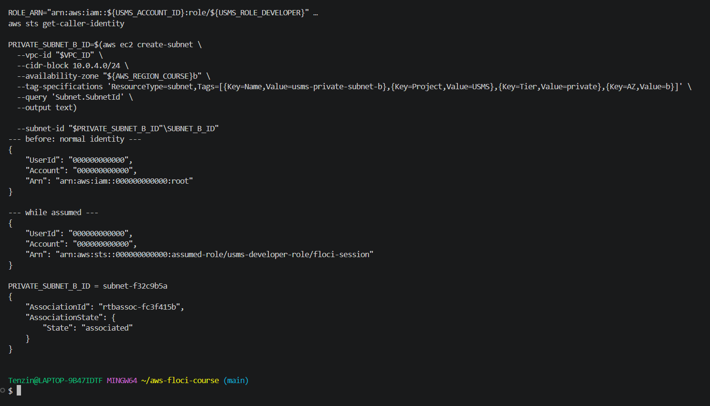
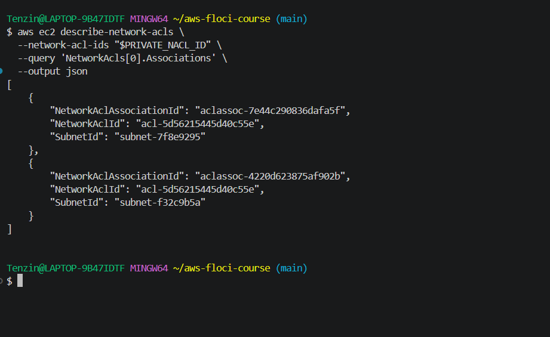
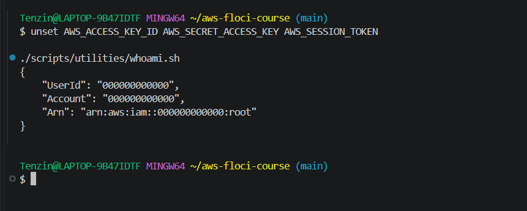
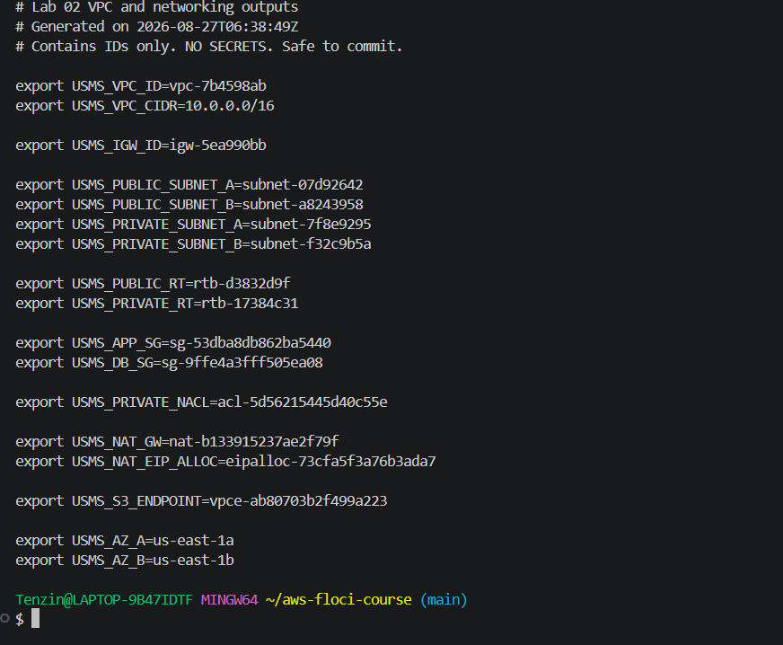
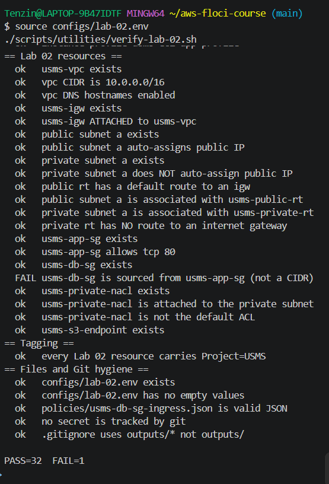
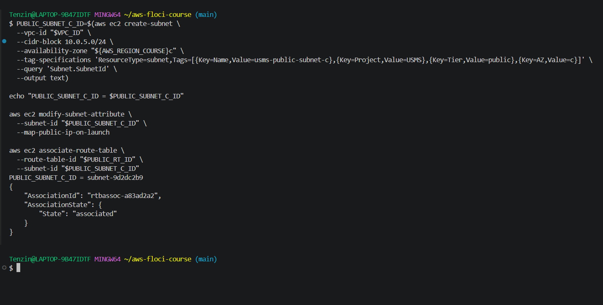
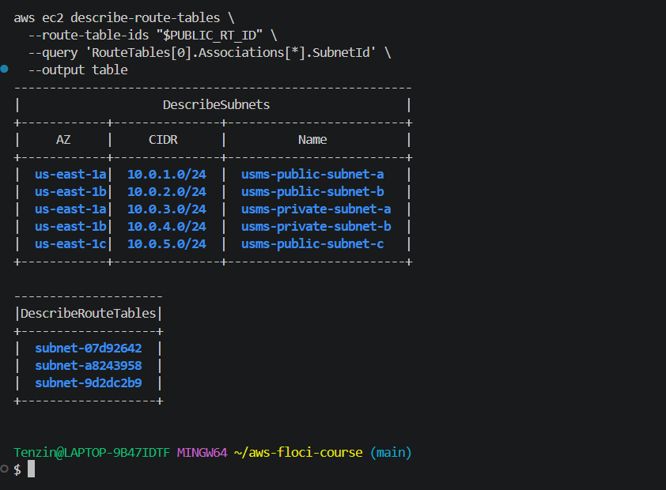
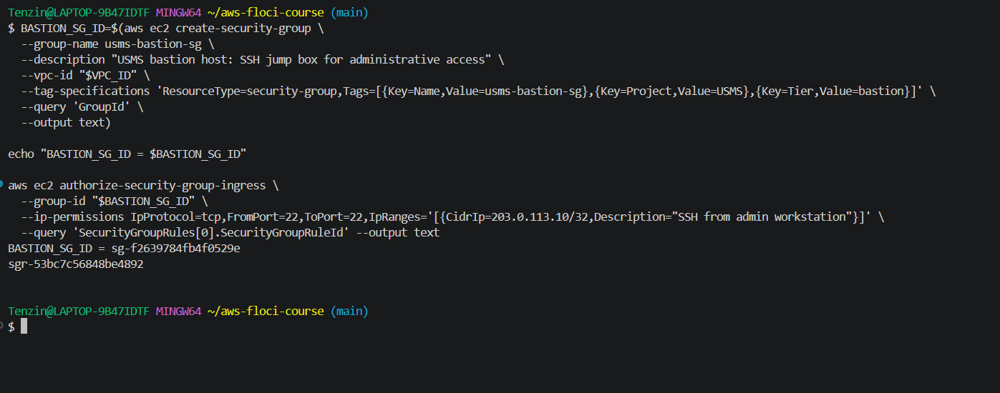
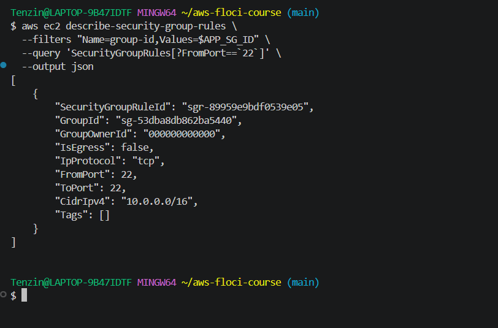
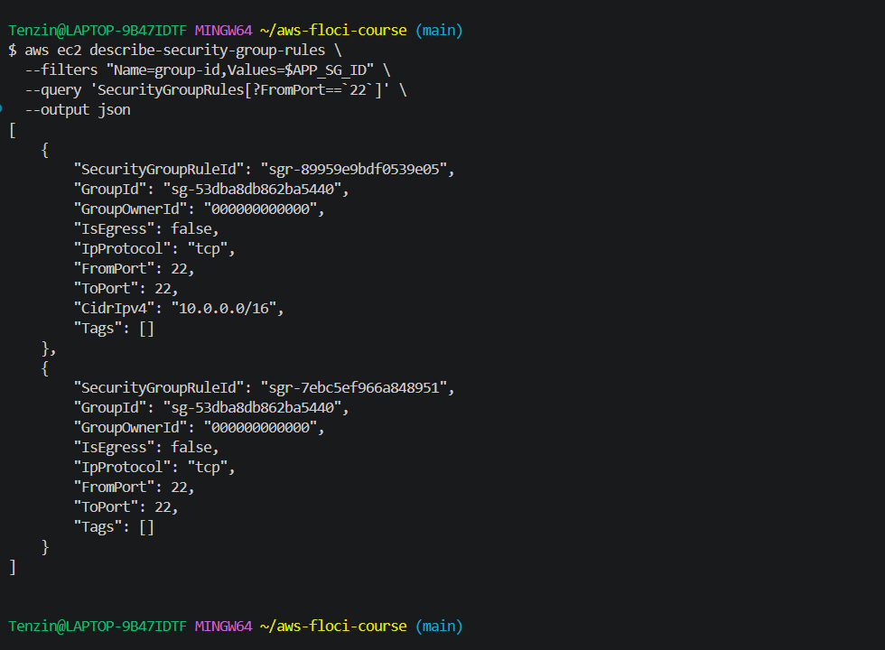

# Lab 02: Independent Lab Exercises

## Exercise 5: Integration, complete the second Availability Zone

RDS needs subnets across at least two Availability Zones for its subnet group in a later lab, and the private tier only existed in one AZ so far. I had to create usms-private-subnet-b while holding usms-developer-role credentials, not my normal identity.

I checked my identity before assuming the role, assumed it, checked identity again to confirm the switch, then created the subnet and associated it with usms-private-rt, all while still holding the assumed role's credentials.

```bash
aws sts get-caller-identity

aws sts assume-role \
  --role-arn "$ROLE_ARN" \
  --role-session-name "lab02-exercise5" \
  --profile usms-dev \
  > outputs/lab-02-exercise5-assumed-role.json

export AWS_ACCESS_KEY_ID=$(jq -r '.Credentials.AccessKeyId' outputs/lab-02-exercise5-assumed-role.json)
export AWS_SECRET_ACCESS_KEY=$(jq -r '.Credentials.SecretAccessKey' outputs/lab-02-exercise5-assumed-role.json)
export AWS_SESSION_TOKEN=$(jq -r '.Credentials.SessionToken' outputs/lab-02-exercise5-assumed-role.json)

aws sts get-caller-identity

PRIVATE_SUBNET_B_ID=$(aws ec2 create-subnet \
  --vpc-id "$VPC_ID" \
  --cidr-block 10.0.4.0/24 \
  --availability-zone "${AWS_REGION_COURSE}b" \
  --tag-specifications 'ResourceType=subnet,Tags=[{Key=Name,Value=usms-private-subnet-b},{Key=Project,Value=USMS},{Key=Tier,Value=private},{Key=AZ,Value=b}]' \
  --query 'Subnet.SubnetId' \
  --output text)

aws ec2 associate-route-table \
  --route-table-id "$PRIVATE_RT_ID" \
  --subnet-id "$PRIVATE_SUBNET_B_ID"
```



The identity before shows my normal root account, and the identity while assumed shows the assumed role ARN instead, so the subnet really was created while holding usms-developer-role, not my own identity.

Next I applied usms-private-nacl to the new subnet, same replace-association pattern from Step 18, except this time I actually checked it landed on the right subnet before moving on, since I made that exact mistake in Step 18 the first time.

```bash
NACL_ASSOC_B=$(aws ec2 describe-network-acls \
  --filters "Name=association.subnet-id,Values=$PRIVATE_SUBNET_B_ID" \
  --query 'NetworkAcls[0].Associations[?SubnetId==`'"$PRIVATE_SUBNET_B_ID"'`].NetworkAclAssociationId | [0]' \
  --output text)

aws ec2 replace-network-acl-association \
  --association-id "$NACL_ASSOC_B" \
  --network-acl-id "$PRIVATE_NACL_ID"
```



Both usms-private-subnet-a and usms-private-subnet-b now show up under usms-private-nacl, and nothing else does.

Then I restored my normal identity right away.

```bash
unset AWS_ACCESS_KEY_ID AWS_SECRET_ACCESS_KEY AWS_SESSION_TOKEN
./scripts/utilities/whoami.sh
```



The lab wants identity restored immediately because usms-developer-role only lasts one hour. If I kept using those credentials for unrelated work afterward, they would expire partway through and give a confusing error that has nothing to do with what actually broke.

Finally I regenerated configs/lab-02.env so USMS_PRIVATE_SUBNET_B would be populated.



I re-ran verify-lab-02.sh afterward and the empty value check passed. The only thing still failing is usms-db-sg is sourced from usms-app-sg (not a CIDR), same Floci bug from Step 15 where group-referenced rules get silently dropped. I already tried fixing that one three different ways back then, so I left it documented instead.

```bash
./scripts/utilities/verify-lab-02.sh
```



PASS=32 FAIL=1.


## Exercise 1: Basic, a third public subnet

I created usms-public-subnet-c in us-east-1c with CIDR 10.0.5.0/24, tagged the same way as the other subnets, turned on auto-assign public IP, and associated it with usms-public-rt. Same pattern as Steps 7, 8, and 11, just a different AZ and CIDR.

```bash
PUBLIC_SUBNET_C_ID=$(aws ec2 create-subnet \
  --vpc-id "$VPC_ID" \
  --cidr-block 10.0.5.0/24 \
  --availability-zone "${AWS_REGION_COURSE}c" \
  --tag-specifications 'ResourceType=subnet,Tags=[{Key=Name,Value=usms-public-subnet-c},{Key=Project,Value=USMS},{Key=Tier,Value=public},{Key=AZ,Value=c}]' \
  --query 'Subnet.SubnetId' \
  --output text)

aws ec2 modify-subnet-attribute \
  --subnet-id "$PUBLIC_SUBNET_C_ID" \
  --map-public-ip-on-launch

aws ec2 associate-route-table \
  --route-table-id "$PUBLIC_RT_ID" \
  --subnet-id "$PUBLIC_SUBNET_C_ID"
```



```bash
aws ec2 describe-subnets \
  --filters "Name=vpc-id,Values=$VPC_ID" \
  --query 'sort_by(Subnets, &CidrBlock)[].{Name:Tags[?Key==`Name`]|[0].Value,CIDR:CidrBlock,AZ:AvailabilityZone}' \
  --output table

aws ec2 describe-route-tables \
  --route-table-ids "$PUBLIC_RT_ID" \
  --query 'RouteTables[0].Associations[*].SubnetId' \
  --output table
```



Five subnets now exist in the VPC, and usms-public-rt shows three associations instead of two. I did not add this subnet to configs/lab-02.env since the exercise says it's practice only and Exercise 4 asks me to remove it later.


## Exercise 2: Intermediate, a bastion security group

I created usms-bastion-sg for a future jump host, allowing SSH only from 203.0.113.10/32 (a documentation address, since I did not want to expose my real IP), with a description on the rule.

```bash
BASTION_SG_ID=$(aws ec2 create-security-group \
  --group-name usms-bastion-sg \
  --description "USMS bastion host: SSH jump box for administrative access" \
  --vpc-id "$VPC_ID" \
  --tag-specifications 'ResourceType=security-group,Tags=[{Key=Name,Value=usms-bastion-sg},{Key=Project,Value=USMS},{Key=Tier,Value=bastion}]' \
  --query 'GroupId' \
  --output text)

aws ec2 authorize-security-group-ingress \
  --group-id "$BASTION_SG_ID" \
  --ip-permissions IpProtocol=tcp,FromPort=22,ToPort=22,IpRanges='[{CidrIp=203.0.113.10/32,Description="SSH from admin workstation"}]' \
  --query 'SecurityGroupRules[0].SecurityGroupRuleId' --output text
```



Then I checked the existing SSH rule on usms-app-sg to get its exact rule ID before touching anything.

```bash
aws ec2 describe-security-group-rules \
  --filters "Name=group-id,Values=$APP_SG_ID" \
  --query 'SecurityGroupRules[?FromPort==`22`]' \
  --output json
```



I added a new SSH rule on usms-app-sg referencing usms-bastion-sg as the source, then revoked the old 10.0.0.0/16 rule by its exact rule ID.

```bash
aws ec2 authorize-security-group-ingress \
  --group-id "$APP_SG_ID" \
  --ip-permissions IpProtocol=tcp,FromPort=22,ToPort=22,UserIdGroupPairs='[{GroupId='"$BASTION_SG_ID"',Description="SSH from bastion host only"}]' \
  --query 'SecurityGroupRules[0].SecurityGroupRuleId' --output text

aws ec2 revoke-security-group-ingress \
  --group-id "$APP_SG_ID" \
  --security-group-rule-ids sgr-89959e9bdf0539e05
```


When I checked the result, both commands had reported success, but neither actually worked the way they should have.

```bash
aws ec2 describe-security-group-rules \
  --filters "Name=group-id,Values=$APP_SG_ID" \
  --query 'SecurityGroupRules[?FromPort==`22`]' \
  --output json
```



The old CIDR based rule (sgr-89959e9bdf0539e05) was still there even though revoke-security-group-ingress reported Return: true, and the new rule I added had no UserIdGroupPairs at all, so the source reference did not save. This is the same bug I ran into in Step 15 with usms-db-sg, except this time it happened on a different security group and a different rule, so it looks like a real, repeatable limitation in this Floci build rather than something tied to one specific rule.

I already proved in Step 15 that restarting Floci and recreating the security group from scratch does not fix this, so I did not repeat that here. The design itself is correct, usms-app-sg's SSH rule is meant to be sourced from usms-bastion-sg instead of the whole VPC range, that intent is fully captured in the commands above, even though Floci's storage cannot reflect it properly.


