# Lab 2 — Virtual Private Cloud and Networking

**Student Name:** Tenzin Namgay

**Student ID:** 02230307

**Module:** DSO303 : Cloud Native Infrastructure

**Practical:** Lab 2 : VPC

## 1. Aim / Objective

The aim of this lab was to build the networking foundation for the University Student Management System (USMS) using a local AWS emulator (Floci), including a VPC, public and private subnets across multiple Availability Zones, routing, security groups, a network ACL, a NAT gateway, and an S3 gateway endpoint, all built and verified using the AWS CLI.

## 2. Introduction

A Virtual Private Cloud (VPC) is an isolated network inside AWS where all of a project's resources live. Inside a VPC, subnets divide that network into smaller pieces, some meant to be reachable from the internet (public) and some meant to never be reachable from it (private). Route tables decide where traffic goes, security groups and network ACLs act as two different kinds of firewall, and a NAT gateway lets private resources reach out to the internet without letting the internet reach in. This lab builds all of these pieces for USMS, reusing the IAM identities created in Lab 1, especially `usms-developer-role`, which was used to actually create the VPC itself.

## 3. Use Case

- Hosting a public-facing web server for students and staff while keeping the database completely unreachable from the internet
- Letting the database server download security patches without ever accepting an inbound connection from outside the VPC
- Restricting SSH access to a small, controlled range instead of leaving it open to the whole internet
- Separating access control into two layers, a per-instance firewall (security groups) and a subnet-wide backstop (network ACLs)

## 4. System Architecture / Design

The VPC uses the address range `10.0.0.0/16`. Inside it there are three public subnets (`usms-public-subnet-a/b/c`) and two private subnets (`usms-private-subnet-a/b`), spread across three Availability Zones. The public subnets route out through an internet gateway, and the private subnets route out through a NAT gateway that itself sits in a public subnet. Two security groups control access at the instance level (`usms-app-sg` for the web tier, `usms-db-sg` for the database tier), and a custom network ACL (`usms-private-nacl`) acts as a subnet-wide backstop on the private tier. An S3 gateway endpoint lets the private subnets reach S3 without going through the NAT gateway at all.

## 5. Implementation Procedure

### Part A — Building the network

I started by sourcing Lab 1's environment and confirming my identity, then read `USMSDeveloperBase`'s current policy version before using it, which by this point was already v3 thanks to Lab 1 Exercise 5, meaning the two extra actions needed for this lab (creating a NAT gateway and allocating an Elastic IP) were already in place.

I assumed `usms-developer-role` and created the VPC as that identity, rather than as my normal root identity, then restored my own identity right away afterward.

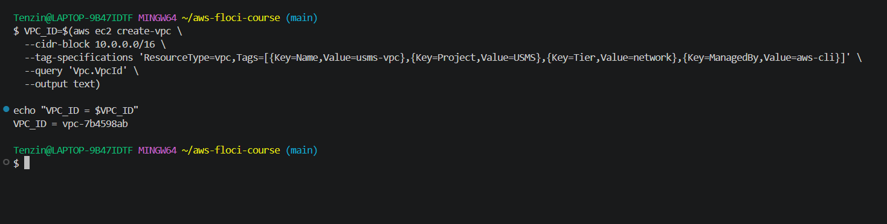

The assume-role output, with the temporary credentials, went into outputs/lab-02-assumed-role.json. I checked that Git ignores it, and git check-ignore named rule 1 of .gitignore, outputs/*.

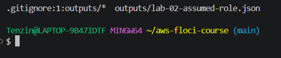

I enabled DNS support and DNS hostnames on the VPC, then created and attached an internet gateway.

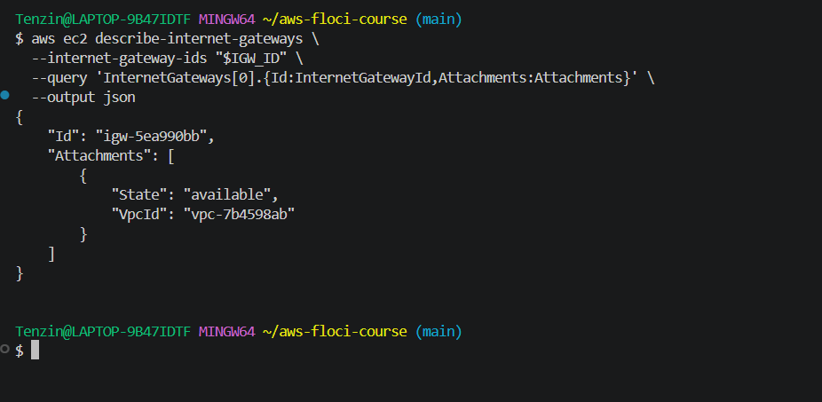

I created the public subnet and turned on auto-assign public IPv4, then created the private subnet without it, deliberately, since an instance in a subnet with no route out should not be given a public address it can never use.

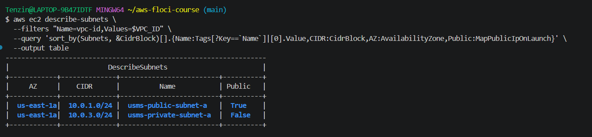

I built a public route table with a default route to the internet gateway, and a private route table with no default route at all, since that absence is the entire technical difference between a public and a private subnet, nothing else about the two subnets is different at the API level.

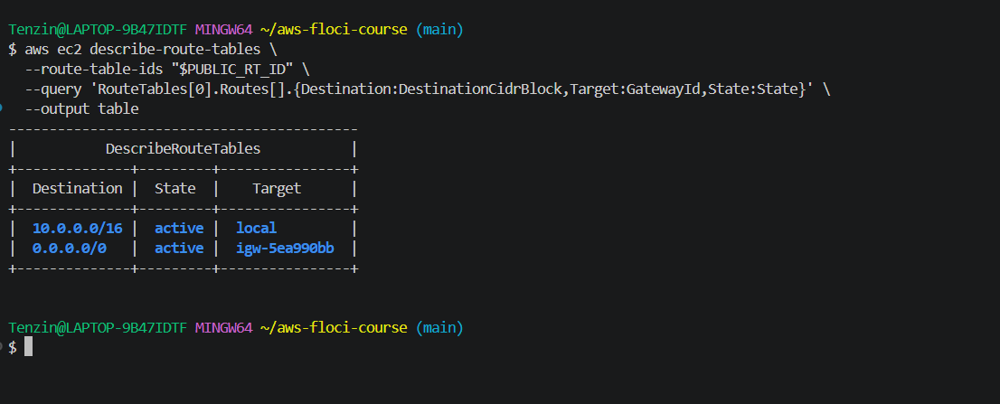

Step 13 asked me to prove the two subnets were actually different, not just assume it because the commands succeeded, so I wrote a loop that reads back each subnet's effective route table and reports its default route target.

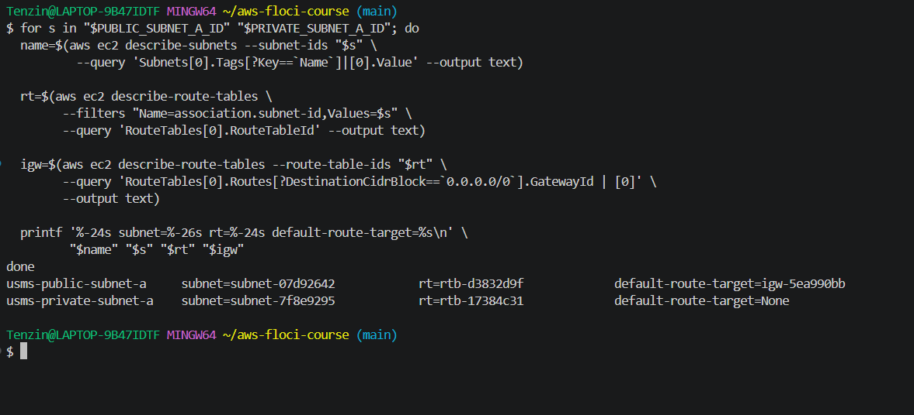

### Part B — Firewalls and outbound access

I created `usms-app-sg` allowing HTTP, HTTPS, and SSH restricted to the VPC's own address range.

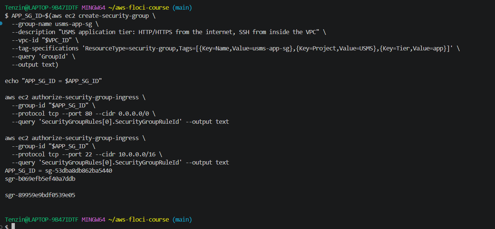

I created `usms-db-sg` and tried to source its PostgreSQL rule from `usms-app-sg` by group reference instead of an address range. This is where I ran into a real Floci limitation, covered fully in the Analysis section below.

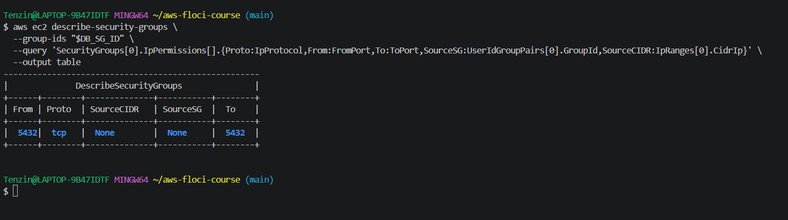

I created a custom network ACL for the private subnet with four explicit rules, including the ephemeral port rule needed because NACLs are stateless.

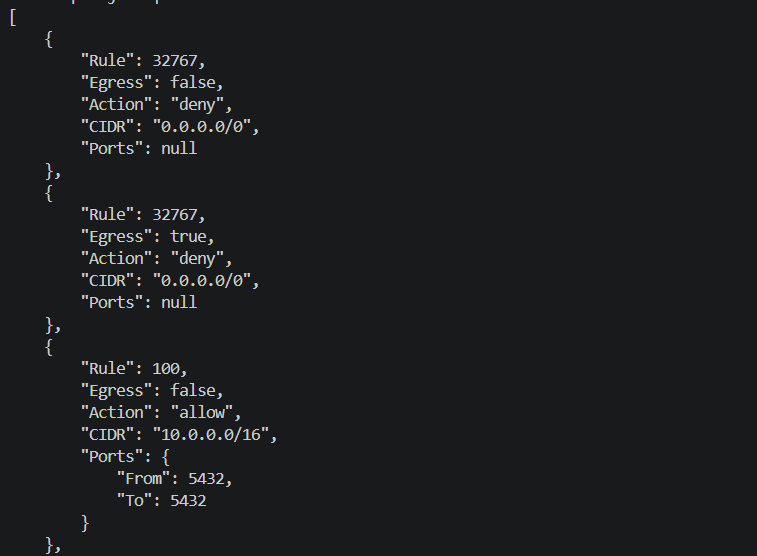

I associated the NACL with the private subnet. On my first attempt I actually attached it to the wrong subnet, the public one, by mistake, caught it during verification, and fixed it properly. This is also covered in the Analysis section below.

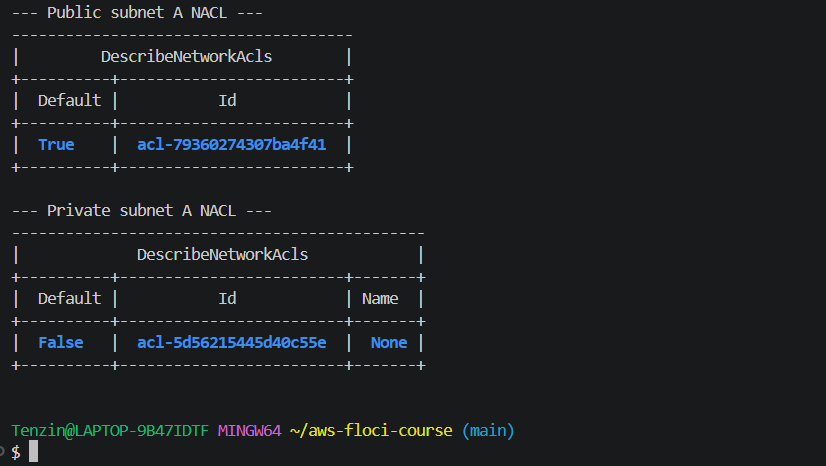

I allocated an Elastic IP and created a NAT gateway in the public subnet, then pointed the private route table's default route at it.

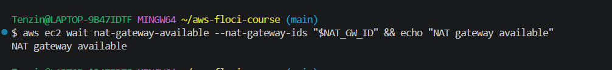

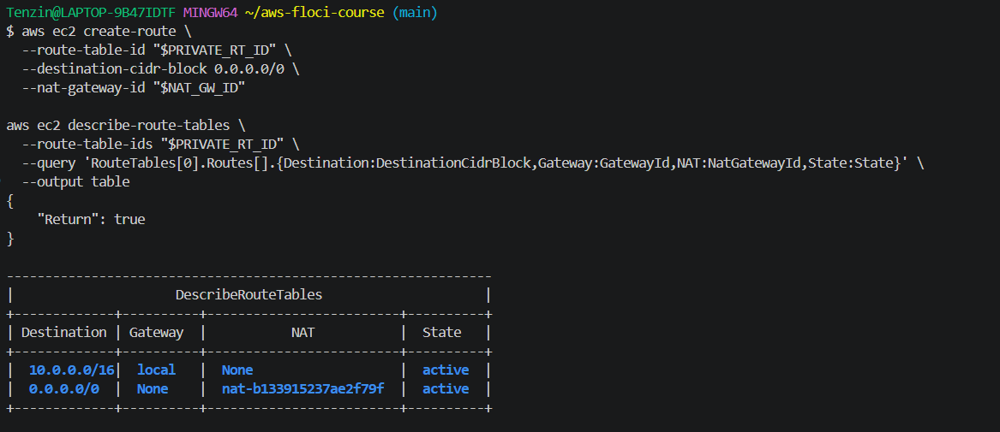

I created a gateway endpoint for S3 so the private subnet can reach S3 without going through the NAT gateway.

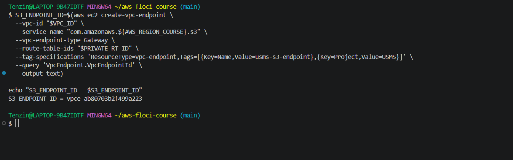

### Part C — Proving it survives, and recording it

I audited every resource's tags to confirm the `Project=USMS` convention held everywhere, then completed the exercise producing a sorted subnet inventory with the private subnet listed first.

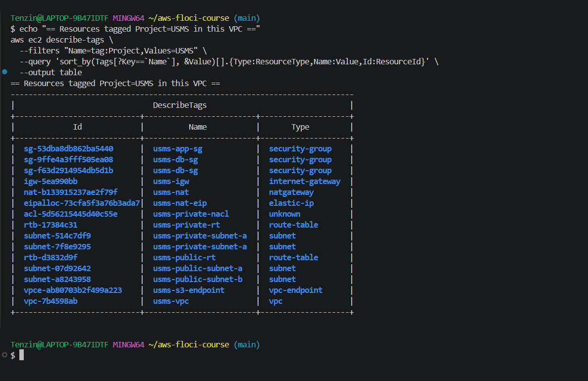

I proved the whole network survives a restart by recording the VPC ID, subnet count, and security group count, restarting Floci, and looking everything up fresh by tag rather than reusing shell variables.

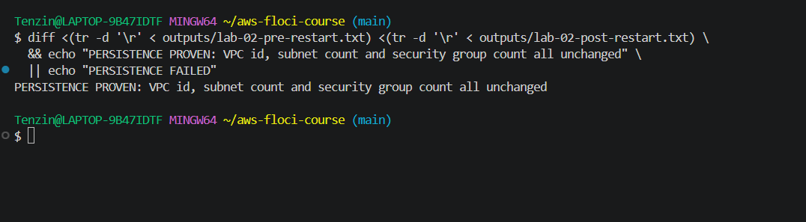

I wrote `configs/lab-02.env` with every resource ID Lab 3 will need, then wrote and ran `verify-lab-02.sh`, which checks 33 separate things about the network.

## 6. Results and Evidence

### 6.1 CLI / SDK Evidence

All screenshots referenced above, plus the full independent exercises with their own evidence, are in `labs/lab-02-vpc/exercises.md`.

### 6.2 AWS Management Console Verification

As with Lab 1, Floci has no graphical console, so all verification was done through the CLI, shown throughout Section 5 above and in `exercises.md`.

## 7. Analysis and Discussion

I built the full network exactly as designed and hit two genuine, reproducible Floci limitations along the way, rather than just my own mistakes.

The first is a duplicate CIDR block. Floci let me create a second subnet with the exact same address range as an existing one, `10.0.3.0/24`, which real AWS would reject outright as an overlapping CIDR. I found it while checking my subnet count during the Exercise 1 "Your turn" task and deleted the duplicate once I confirmed it had no route table association yet.

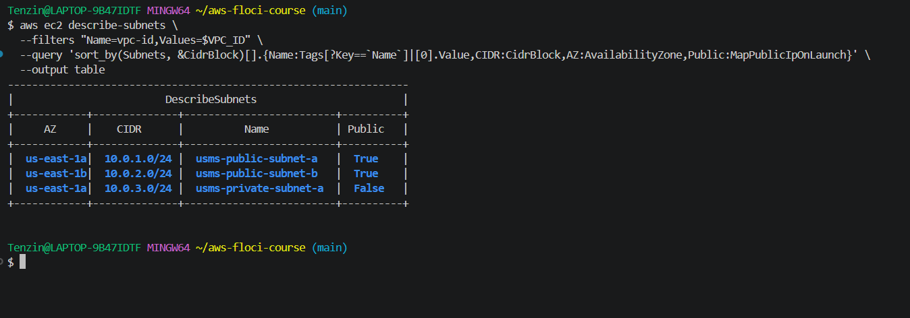

The second, more significant limitation is that Floci does not correctly save group-referenced security group rules. Every time I authorized a rule with `UserIdGroupPairs` (referencing another security group as the source instead of a CIDR block), the command reported success and returned a real rule ID, but the actual source was silently dropped when I read the rule back. I confirmed this was not a mistake in my commands by trying it three different ways in Step 15 alone, the original attempt, a fresh security group created from scratch, and again after a full Floci restart, all with the identical result. I hit the exact same bug two more times independently, in Exercise 2's bastion rule and Exercise 4's exam service rule, and a classmate on a completely different machine reproduced the identical failure, which rules out anything specific to my own setup. `revoke-security-group-ingress` had a matching problem, reporting success while not actually removing the rule it was told to remove.

I also made one real mistake of my own, not a tool limitation, when associating the private NACL with a subnet in Step 18. The `replace-network-acl-association` command succeeded, but I had actually passed the wrong subnet's association ID, so I ended up putting my custom NACL on the public subnet instead of the private one. I caught this by reading the association back afterward rather than trusting the command's success message, restored the public subnet to the default NACL, and correctly re-associated the private one, the same discipline the lab teaches throughout, that a command succeeding is not the same as it doing the right thing.

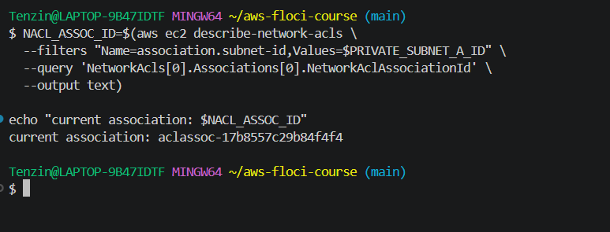

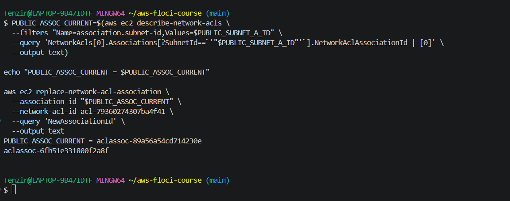

Because Floci does not enforce security groups or NACLs against real traffic at all, judging whether my rules were correct meant reading the actual JSON documents and the actual API responses, not testing a connection, since a connection would have worked identically whether the rule was airtight or wide open.

## 8. Reflection

**What did I learn about this AWS service?**
I learned that a public subnet is not a property of the subnet itself, it is a property of its route table, specifically whether that table has a default route pointing at an internet gateway. Nothing else, not the name, not a tag, not the auto-assign IP setting, makes any difference.

**What challenges did I encounter?**
Most of my real challenges were Floci itself, rather than the networking concepts. The group-referenced security group bug was the biggest one, and I only trusted my conclusion about it once I had reproduced it three separate ways and a classmate reproduced it independently on their own machine. I also caused one genuine mistake myself when I put a NACL on the wrong subnet, which taught me to always read a change back rather than trust that a successful command did what I intended.

**How would I apply this in a real world cloud environment?**
I would design the public and private split the same way, using the route table as the actual mechanism rather than naming conventions, and I would use security groups as the main access control layer since they are stateful and can reference each other, keeping NACLs as a subnet-wide safety net. I would also budget carefully for NAT gateways, since Exercise 4 showed me that a single one already costs around $32 a month before any data even crosses it, and a second one for high availability would double that cost on what is often the largest line item on a small VPC's bill.

**What additional concepts would I like to explore?**
I would like to see how VPC peering and Transit Gateway work for connecting multiple VPCs together, since this lab only touched a single, self-contained network.

## 9. Conclusion

This lab built the complete network layer for USMS: a VPC with five subnets across three Availability Zones, public and private routing, two security groups, a custom network ACL, a NAT gateway, and an S3 endpoint. I completed all five independent exercises, wrote a verification script that checks 33 separate facts about the network, and wrote a cleanup script without ever running it. Along the way I found and properly investigated two real Floci limitations rather than assuming my own work was wrong, and I caught and fixed one genuine mistake of my own by checking my work rather than trusting a command's success message.

## 10. Appendix (Optional)

- GitHub repository: https://github.com/Eyemusican/dso303-lab01-iam
- Exercises with full evidence: `labs/lab-02-vpc/exercises.md`
- Review questions: `notes/lab-02-notes.md`
- Scripts: `scripts/utilities/verify-lab-02.sh`, `scripts/cleanup/lab-02-cleanup.sh`, `scripts/utilities/lab-02-network-report.sh`