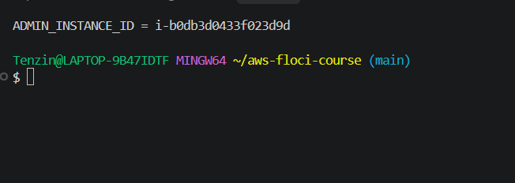
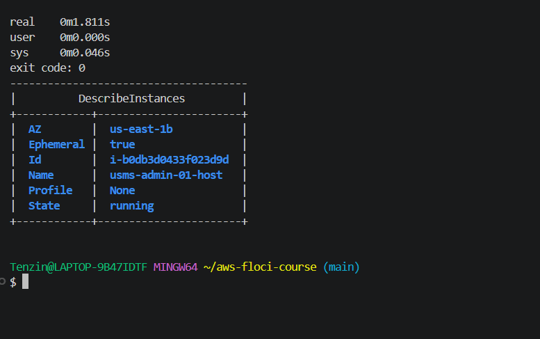
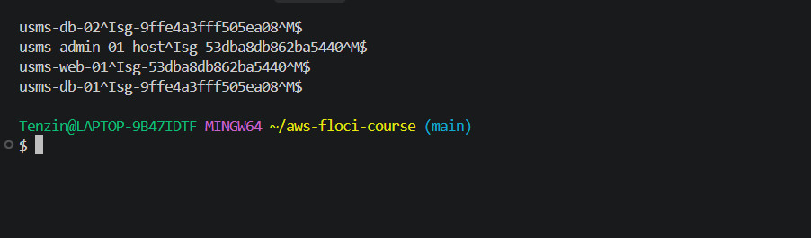
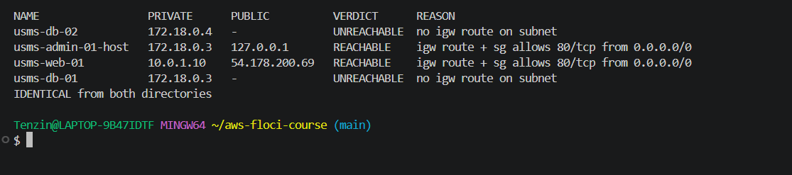

# Lab 03 Exercises

## Exercise 1: A maintenance instance

I launched usms-admin-01-host as a t3.micro in usms-public-subnet-b with the usms-app-key key pair and the usms-app-sg security group. I did not give it an instance profile, because an admin host does not need to call S3. I tagged it Project=USMS, Tier=admin, Lab=03 and Ephemeral=true, and I did not record it in configs/lab-03.env because Exercise 4 removes it.

I used the long command form, not --cli-input-json, and waited with aws ec2 wait instance-running instead of sleep. The waiter finished in about 1.8 seconds with exit code 0.

**Result:** filtering on Tier=admin returned exactly one running instance, i-b0db3d0433f023d9d, in us-east-1b, with no instance profile.

## Exercise 3: A reachability report

I wrote scripts/utilities/lab-03-reachability.sh. For every running instance tagged Project=USMS it prints the name, private IP, public IP and a verdict. The verdict only comes from the subnet's route table, the public address and the security groups, never from the instance name or tags.

The verdicts are:
- REACHABLE: the subnet has a 0.0.0.0/0 route to an internet gateway, the instance has a public address, and a security group allows tcp 80 from 0.0.0.0/0.
- NO-ADDRESS: the subnet has an internet gateway route but the instance has no public address. It is a separate state because the network path exists, but nothing on the internet can address the instance. It is not blocked by a firewall and not missing a route.
- UNREACHABLE: the subnet has no route to an internet gateway.
- BLOCKED: route and address exist but no security group allows tcp 80 from 0.0.0.0/0.

The script uses set -uo pipefail but not set -e. Many lookups can return nothing on purpose, like an instance without a public IP, and with -e one empty lookup would stop the report halfway. Instead every value is checked and None is treated as absent. It finds the repo root from its own location, so it works from any folder, and it has no hard coded IDs.

**Two issues I fixed:**
1. Floci never shows an Elastic IP in the instance's PublicIpAddress field (see Step 13). So the script also checks describe-addresses for an Elastic IP linked to the instance. This is also correct on real AWS, because an Elastic IP is a public address.
2. On Windows, aws --output text ends each line with a hidden \r. The security group ID was the last column, so it became "sg-...\r" and the security group lookup failed, which made every public instance show BLOCKED. cat -A showed ^M at the end of each line. I fixed it by piping the output through tr -d '\r'.

**Result:** usms-web-01 and usms-admin-01-host are REACHABLE, usms-db-01 and usms-db-02 are UNREACHABLE. The output was identical when I ran it from ~ and from labs/lab-03-ec2/.

**Floci notes:** usms-admin-01-host got 127.0.0.1 as its public IP, which is the local Docker address and not a real public IP. It also shares 172.18.0.3 with usms-db-01, because usms-db-01's container stopped during the Floci restart and Docker reused the address.

