# Lab 03 Exercises

## Exercise 1: A maintenance instance

I launched usms-admin-01-host as a t3.micro in usms-public-subnet-b with the usms-app-key key pair and the usms-app-sg security group. I did not give it an instance profile, because an admin host does not need to call S3. I tagged it Project=USMS, Tier=admin, Lab=03 and Ephemeral=true, and I did not record it in configs/lab-03.env because Exercise 4 removes it.

I used the long command form, not --cli-input-json, and waited with aws ec2 wait instance-running instead of sleep. The waiter finished in about 1.8 seconds with exit code 0.

**Result:** filtering on Tier=admin returned exactly one running instance, i-b0db3d0433f023d9d, in us-east-1b, with no instance profile.

## Exercise 2: A self describing bootstrap

I wrote labs/lab-03-ec2/user-data-db.sh for the data tier. It installs PostgreSQL, creates a database called usms, and writes a marker file at /var/log/usms-db-bootstrap.done with the instance ID and the UTC time. The first lines check for that marker, and if it already exists the script exits straight away without changing anything, so running it twice is safe. bash -n passed and the script is 877 bytes, well under 16 KB.

I used a quoted heredoc ('EOF') so that $MARKER, $TOKEN, $INSTANCE_ID and $(date) were written into the file as text and only run later on the instance, not on my laptop.

I launched usms-db-02 in usms-private-subnet-b with usms-db-sg and this user data, and no instance profile.

**Proving the user data:** describe-instance-attribute returned no UserData on Floci, the same limitation as Step 12. So I read the stored script from Floci's storage file for usms-db-02 and compared it with diff. Both were 877 bytes and diff printed nothing, so they are byte identical.

**Proving idempotence:** I could not run the script inside Floci, so I tested just the marker check on my laptop. I created a fake marker file, pointed the script at it and ran the first 8 lines. It printed "USMS db bootstrap already done, exiting" with exit code 0, so a second run stops before changing anything.

**When could a rerun actually happen?** User data normally runs only once, on the first boot of an instance. A rerun could still happen if someone changes the cloud-init settings to run user scripts on every boot, if someone runs the script again by hand to repair the server, or if a new instance is launched from an AMI made from this one. In that last case cloud-init sees a new instance ID and runs the user data again, but the marker file is already inside the image, so the script exits early instead of trying to create the usms database a second time.

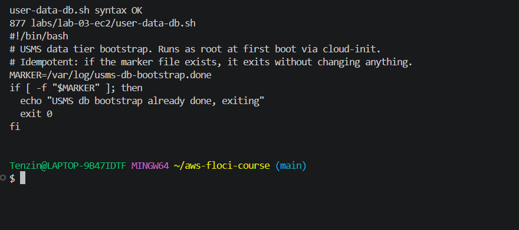
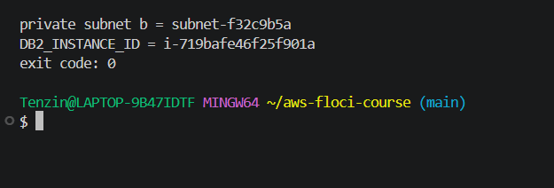
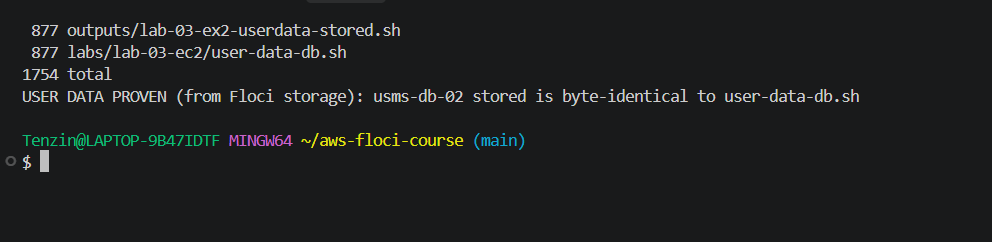
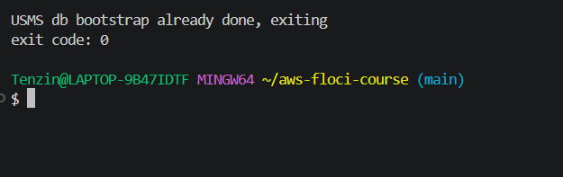

## Exercise 3: A reachability report

I wrote scripts/utilities/lab-03-reachability.sh. For every running instance tagged Project=USMS it prints the name, private IP, public IP and a verdict. The verdict only comes from the subnet's route table, the public address and the security groups, never from the instance name or tags.

The verdicts are:
- REACHABLE: the subnet has a 0.0.0.0/0 route to an internet gateway, the instance has a public address, and a security group allows tcp 80 from 0.0.0.0/0.
- NO-ADDRESS: the subnet has an internet gateway route but the instance has no public address. It is a separate state because the network path exists, but nothing on the internet can address the instance. It is not blocked by a firewall and not missing a route.
- UNREACHABLE: the subnet has no route to an internet gateway.
- BLOCKED: route and address exist but no security group allows tcp 80 from 0.0.0.0/0.

The script uses set -uo pipefail but not set -e. Many lookups can return nothing on purpose, like an instance without a public IP, and with -e one empty lookup would stop the report halfway. Instead every value is checked and None is treated as absent. It finds the repo root from its own location, so it works from any folder, and it has no hard coded IDs.

**Two issues I fixed:**
1. Floci never shows an Elastic IP in the instance's PublicIpAddress field (see Step 13). So the script also checks describe-addresses for an Elastic IP linked to the instance. This is also correct on real AWS, because an Elastic IP is a public address.
2. On Windows, aws --output text ends each line with a hidden \r. The security group ID was the last column, so it became "sg-...\r" and the security group lookup failed, which made every public instance show BLOCKED. cat -A showed ^M at the end of each line. I fixed it by piping the output through tr -d '\r'.

**Result:** usms-web-01 and usms-admin-01-host are REACHABLE, usms-db-01 and usms-db-02 are UNREACHABLE. The output was identical when I ran it from ~ and from labs/lab-03-ec2/.

**Floci notes:** usms-admin-01-host got 127.0.0.1 as its public IP, which is the local Docker address and not a real public IP. It also shares 172.18.0.3 with usms-db-01, because usms-db-01's container stopped during the Floci restart and Docker reused the address.

## Exercise 4: Right size and clean up

### Before starting
When I came back to the lab, usms-db-02 was stuck in pending after Floci restarted, the same restart limitation I hit in Step 9. A stop and start brought it back to running.

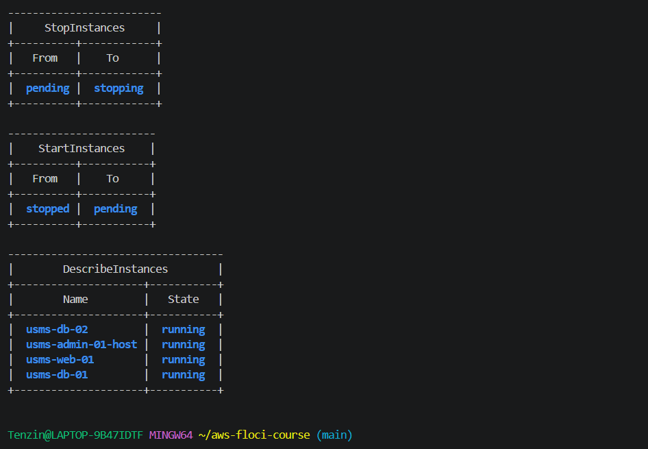

### The problem
The portal has 400 concurrent users at peak, mostly reading. The single t3.micro runs at 85 percent CPU at midday and is idle overnight.

### Burstable CPU credits
A t3 instance earns CPU credits while it runs below its baseline and spends them when it runs above. A t3.micro has a baseline of 10 percent per vCPU. 85 percent sustained is a specific problem for a t instance because it is far above that baseline, so the credits run out.

What happens next depends on the credit mode. In standard mode the instance gets throttled down to its baseline, so the portal would get slow at the busiest time. In unlimited mode it keeps running fast, but AWS charges surplus credits at $0.05 per vCPU hour (Linux). T3 instances launch in unlimited mode by default.

I tried aws ec2 describe-instance-credit-specifications to check the mode of usms-web-01, but Floci returned UnsupportedOperation. The lab hint expected this command to work, so this is a Floci limitation the lab did not list. On real AWS it would return unlimited, because that is the T3 default and I never changed it.

### My assumption for the numbers
Busy about 6 hours a day at 85 percent, around 5 percent for the other 18 hours. Average over 24 hours = (6 x 85 + 18 x 5) / 24 = 25 percent. A month is 730 hours (about 30 days).

### Option 0: keep one t3.micro (current)
- Instance: $0.0104/hr x 730 = $7.59
- Surplus credits: (25% average minus 10% baseline) x 2 vCPU x 24 h = 7.2 vCPU hours a day x $0.05 = $0.36 a day, about $10.80 a month
- Total: about $18.39 a month, and the instance is still overloaded at midday.

### Option A: scale up to t3.small
- Instance: $0.0208/hr x 730 = $15.18
- Baseline goes up to 20 percent, so surplus is (25 minus 20) x 2 x 24 = 2.4 vCPU hours a day, about $3.60 a month
- Total: about $18.78 a month

The catch: t3.micro and t3.small both have 2 vCPUs. Scaling up doubles the memory but adds no CPU, so midday is still at 85 percent. It also does nothing about the overnight idle time, because one bigger instance still runs all night.

### Option B: scale out to 2 x t3.micro behind an Application Load Balancer
- Instances: 2 x $7.59 = $15.18
- The load is split, so each runs around 42.5 percent at midday. Average each = (6 x 42.5 + 18 x 5) / 24 = about 14.4 percent, surplus about 2.1 vCPU hours a day, about $3.15 a month each, $6.30 for both
- ALB: $0.0225/hr x 730 = $16.43, plus about 1 LCU x $0.008 x 730 = $5.84
- Total: about $43.75 a month

With an Auto Scaling group, the second instance only needs to run during the busy hours, about 6 hours a day, which brings the second instance down to around $1.90 a month and the total to roughly $30.

### What I would change
I would scale out, not up. Scaling up within t3 small and medium gives no extra vCPUs, so it does not fix the midday CPU. Scaling out spreads the readers across instances, puts them in two Availability Zones so one zone failing does not take the portal down, and with Auto Scaling it handles the overnight idle time by removing the extra instance at night. It costs more than option 0 on paper, but option 0 is already overloaded.

Prices are for Linux on demand in us-east-1, from economize.cloud (EC2 instance prices), the AWS T3 instance page (unlimited mode and $0.05 per vCPU hour), the AWS Networking blog on public IPv4 ($0.005 per IP per hour) and serverscheduler.com (ALB $0.0225 per hour and $0.008 per LCU hour). Official EC2 on demand pricing page: https://aws.amazon.com/ec2/pricing/on-demand/

### What I checked before deleting
- Orphaned volumes: describe-volumes with status=available returned nothing, so there were none to delete.
- Elastic IPs: usms-web-eip is associated with usms-web-01. usms-nat-eip showed no instance, but its allocation ID eipalloc-73cfa5f3a76b3ada7 matches the one used by the NAT gateway nat-b133915237ae2f79f, which is available. So it is in use by the NAT gateway, not orphaned, and Lab 2 still needs it.
- The only ephemeral resource was usms-admin-01-host from Exercise 1.

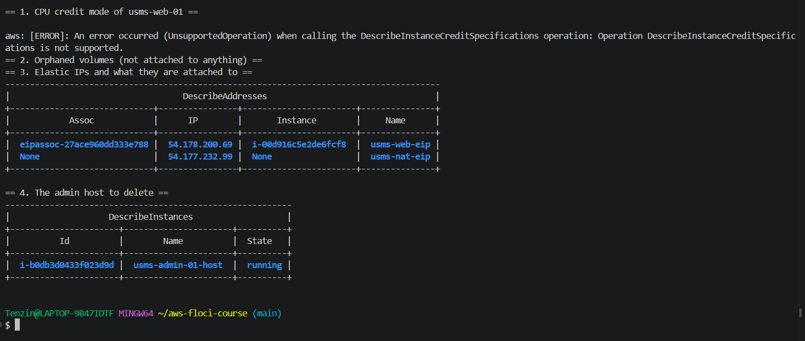
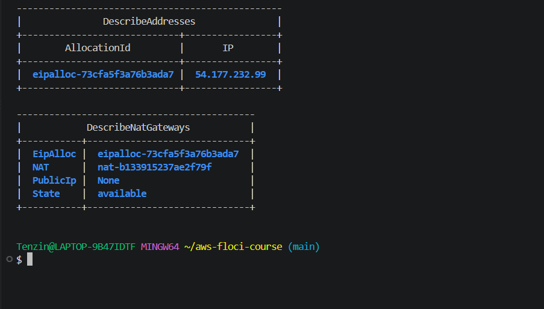

### Deleting the ephemeral resource

**What will be deleted:** usms-admin-01-host (i-b0db3d0433f023d9d) and its root volume, because root volumes have DeleteOnTermination set to True.
**What depends on it:** nothing. It has no Elastic IP, no data volume and is not in configs/lab-03.env.
**Reversible:** no. A terminated instance cannot be started again.
**Effect on later labs:** none. It is in the CLEAN UP column, not KEEP.

Normally the order is disassociate the Elastic IP, then detach and delete data volumes, then terminate. This host had no Elastic IP and no data volume, so terminating it was the only step. I checked the name and the Ephemeral=true tag before running it.

    aws ec2 terminate-instances --instance-ids i-b0db3d0433f023d9d

It went from running to shutting-down to terminated, and usms-web-01, usms-db-01 and usms-db-02 stayed running. There were no orphaned volumes and no unassociated Elastic IPs to delete.

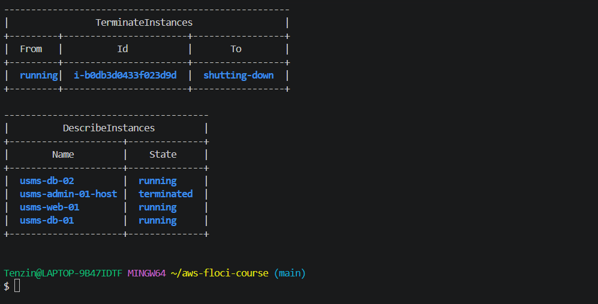

### Verification after deleting
verify-lab-03.sh still reported PASS=34 FAIL=2, the same two failures as before, so the deletion did not break anything.

1. private key is chmod 600: on Windows NTFS, stat in Git Bash always reports 644. I applied the Windows equivalent with icacls (only my user can read the key).
2. usms-web-01 has a public address: Floci never writes the Elastic IP into the instance's PublicIpAddress field. The very next check, that an Elastic IP is associated with usms-web-01, passes.

I tried once more to fix the second one. I noticed usms-admin-01-host had a public address while it had a running container, and usms-web-01 lost its container in a Floci restart. So I removed the dead container and stopped and started usms-web-01, but Floci did not rebuild the container and PublicIpAddress stayed None. On real AWS, the Elastic IP 54.178.200.69 would show on the instance and this check would pass.

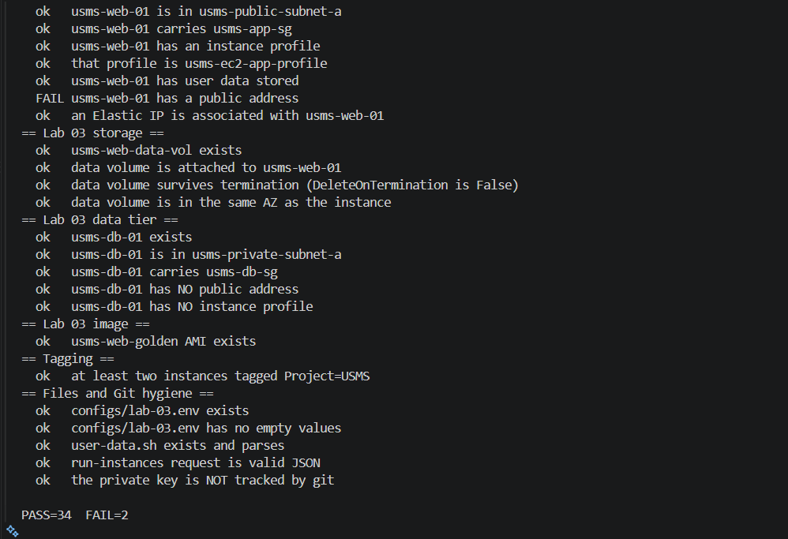
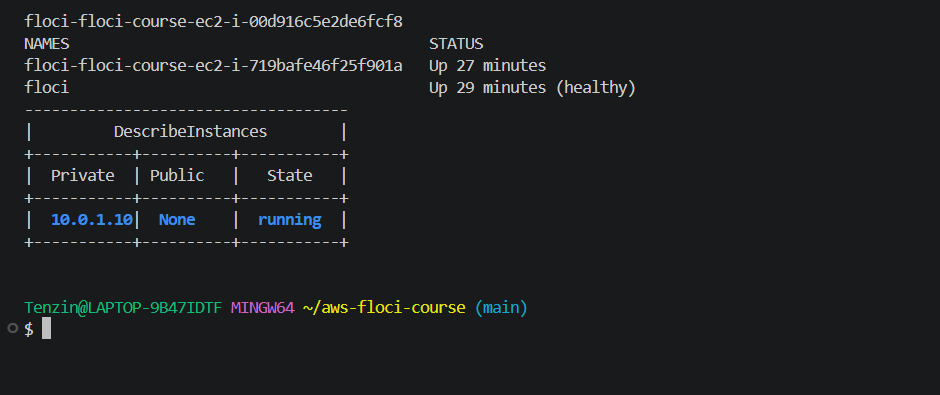

## Exercise 5: Prepare the S3 hand off for Lab 4

### The upload script
I wrote labs/lab-03-ec2/transcript-upload.sh. It is meant to run on usms-web-01. It takes a student ID and a file path and uploads the file to s3://usms-student-data/transcripts/<student-id>/<filename>. It does not contain, read or pass any access key. On a real instance the AWS CLI gets temporary credentials for usms-ec2-app-role from the instance metadata service through the instance profile.

It checks its arguments. With no arguments it prints "expected 2 arguments, got 0" and a usage line and exits with code 2. With a file that does not exist it prints "file not found" and exits with code 3. I also searched the script for access keys, secrets and session tokens and found none in the code.

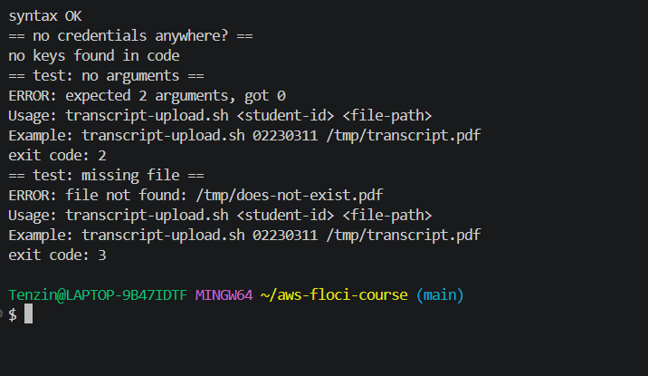

### The outbound rule I never wrote
I did not add a port 443 rule to usms-app-sg. Its outbound rules show the default rule, protocol -1 to 0.0.0.0/0.

The default outbound rule allows all traffic to 0.0.0.0/0, so usms-web-01 can open an HTTPS connection to S3 on port 443 without me adding anything, and because security groups are stateful, the replies from S3 come back in automatically.

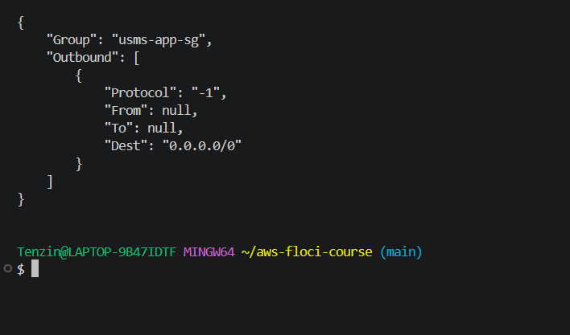

### The readiness file
I wrote outputs/lab-03-s3-readiness.txt with the instance ID i-00d916c5e2de6fcf8, the instance profile ARN, the role usms-ec2-app-role, the attached policy USMSStudentDataReadWrite and the bucket ARN in the policy, arn:aws:s3:::usms-student-data.

I ran aws s3api head-bucket --bucket usms-student-data and captured the failure instead of hiding it. It returned exit code 254 with a 404 Not Found error, because the bucket does not exist yet. That failure is the point: once the bucket is created, the same command should return exit code 0, and usms-web-01 should be able to read and write transcripts through the instance profile with no keys on disk.

The file is in outputs/, which is git ignored, so it stays on my machine for Lab 4 to read.

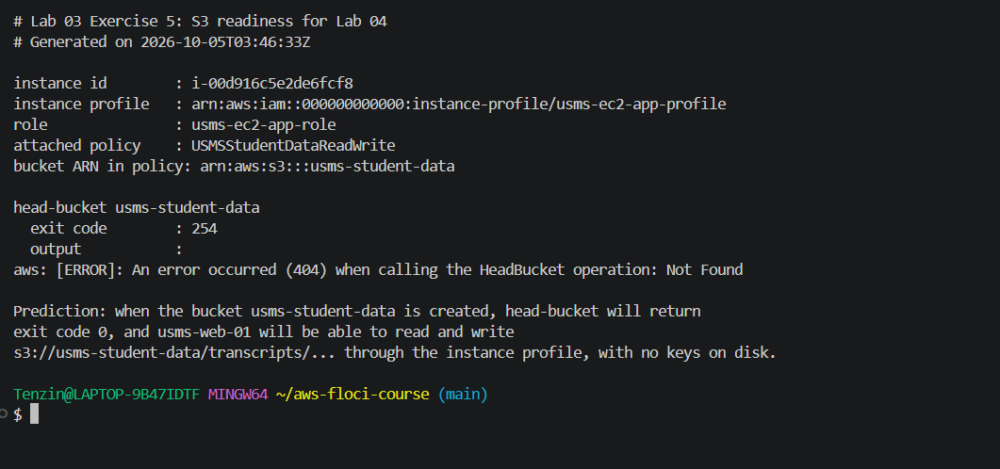

### The bucket name
configs/lab-01.env already has USMS_BUCKET_NAME=usms-student-data on line 35, so I did not add it again to configs/lab-03.env. Lab 4 can source the intended name from lab-01.env.

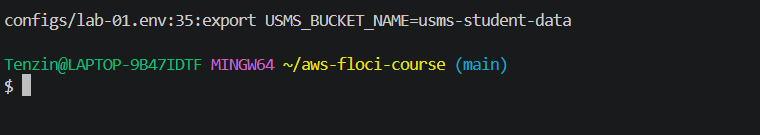