# Lab 3: Amazon EC2 and Deploying the USMS Application

**Student Name:** Tenzin Namgay

**Student ID:** 02230307

**Module:** DSO303 : Cloud Native Infrastructure

**Practical:** Lab 3 : EC2

## 1. Aim / Objective

The aim of this lab was to deploy the University Student Management System (USMS) as a two tier application on Amazon EC2 inside the network from Lab 2, using a local AWS emulator (Floci) and the AWS CLI. This included launching a web server into the public subnet with the instance profile from Lab 1, bootstrapping it with user data, giving it a stable Elastic IP, attaching a separate EBS data volume, launching a database server into the private subnet, creating a golden AMI, and proving each part worked instead of trusting that the commands succeeded.

## 2. Introduction

Amazon EC2 provides virtual servers in the cloud. Three things combine to make a running instance: an AMI, which is the template for the root disk, an instance type, which is the hardware size (t3.micro is 2 vCPUs and 1 GiB of memory), and user data, a script that cloud-init runs once as root on the first boot so the server can set itself up without anyone logging in. Around the instance sit other pieces: key pairs for SSH access, instance profiles that give the server an IAM role without storing any access keys, Elastic IPs for a public address that does not change, and EBS volumes for storage that lives separately from the instance. EC2 matters because it is the basic compute layer that most other AWS services build on, and it is where the IAM work from Lab 1 and the network from Lab 2 finally come together into one running system.

## 3. Use Case

- Hosting the USMS student portal on a web server in a public subnet, reachable on port 80 through a stable address
- Running the database tier in a private subnet with no public address and no route in from the internet
- Letting the web server read and write student transcripts in S3 through an instance profile, with no access key ever stored on the machine
- Keeping student data on a separate EBS volume so it survives if the server is terminated
- Capturing a configured server as a golden AMI so new servers can be launched ready to use, for example by an Auto Scaling group later in the course

## 4. System Architecture / Design

Everything sits inside usms-vpc (10.0.0.0/16) from Lab 2. usms-web-01 is a t3.micro in usms-public-subnet-a (10.0.1.0/24, us-east-1a). It carries usms-app-sg, has usms-ec2-app-profile from Lab 1 attached, and has the Elastic IP usms-web-eip (54.178.200.69). Its root volume comes from the AMI, and a separate 8 GiB gp3 volume, usms-web-data-vol, is attached as /dev/sdf. usms-db-01 is a t3.micro in usms-private-subnet-a (10.0.3.0/24) with usms-db-sg, no public address and no instance profile. The public subnet routes to the internet through usms-igw, and the private subnet only goes out through usms-nat. A golden AMI, usms-web-golden, was created from usms-web-01 for Lab 8.

    Internet
       |
    usms-igw
       |
    usms-public-subnet-a (10.0.1.0/24)          usms-private-subnet-a (10.0.3.0/24)
     usms-web-01  [usms-app-sg]                   usms-db-01  [usms-db-sg]
       |  EIP 54.178.200.69                         no public IP, no profile
       |  profile usms-ec2-app-profile              outbound only via usms-nat
       |  -> usms-ec2-app-role                      admits 5432 from usms-app-sg
       |  -> USMSStudentDataReadWrite
       |  root volume + usms-web-data-vol (/dev/sdf)
       |
    golden AMI usms-web-golden

## 5. Implementation Procedure

### Part A: Getting ready to launch

I started by loading the env files from Lab 1 and Lab 2 and checking that Lab 2's network was still intact. verify-lab-02.sh gave PASS=32 FAIL=1, where the one failure is the group referenced security group rule that Floci drops, which I already documented in Lab 2.

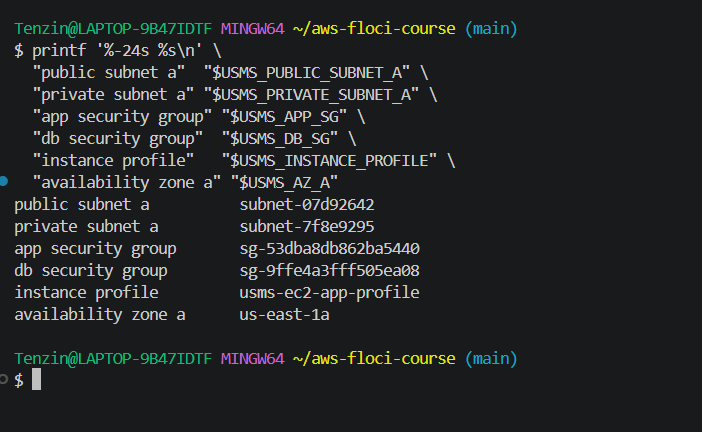
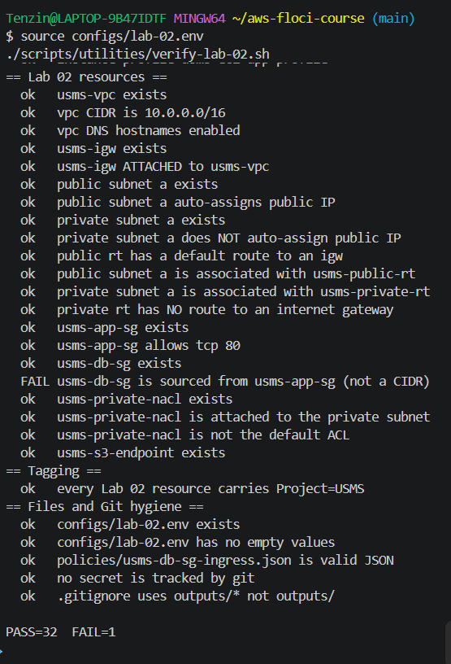

I found an AMI with describe-images instead of copying an ID from somewhere, and used the first one, ami-0abcdef1234567890 (Amazon Linux 2). I created the key pair usms-app-key and sent the private key straight to outputs/usms-app-key.pem so it never showed on screen, then proved Git ignores it.

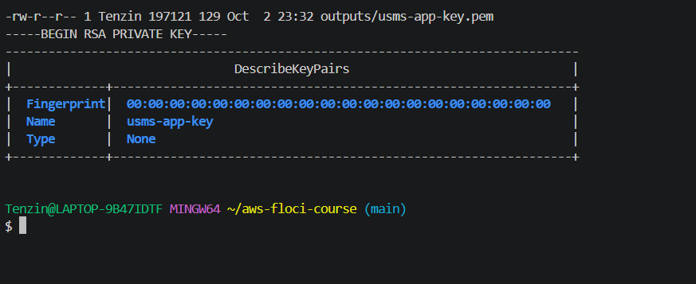
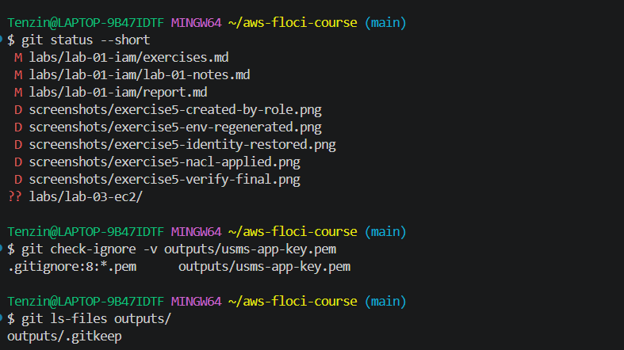

I wrote the user data script labs/lab-03-ec2/user-data.sh with a quoted heredoc so the variables would only be filled in on the instance, checked it with bash -n, and wrote the launch request as a JSON file in templates/ instead of one long command.

### Part B: Launching and checking the web server

I launched usms-web-01 with one run-instances call that used a subnet and a security group from Lab 2, the instance profile from Lab 1, and the key pair and user data from this lab.

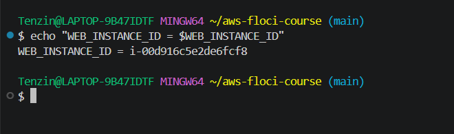

The instance was stuck in pending for about 9 minutes because Floci had to download the amazonlinux:2 image first, and the first download failed on the college network. Later, switching networks restarted Floci and killed the instance's container, so I fixed it with a stop and start. This is covered in Section 7.

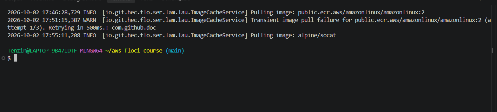

I read the instance back and checked the important fields: running, in the public subnet, private IP 10.0.1.10, usms-app-sg, and the instance profile ARN.

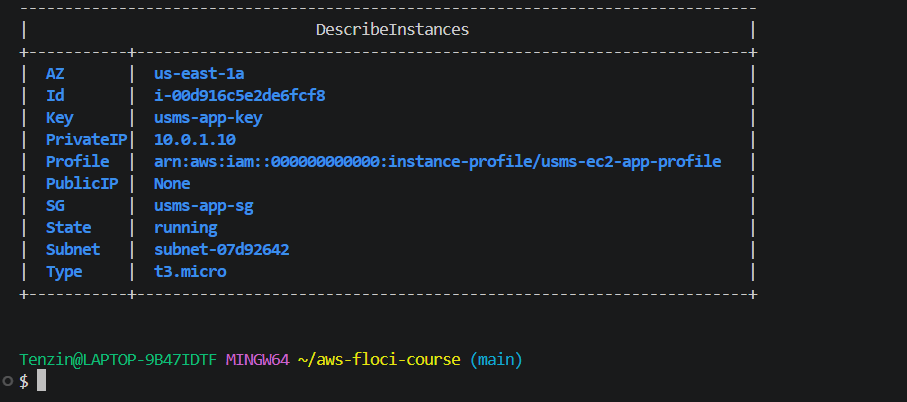

I traced the permission chain from the instance to the profile, to usms-ec2-app-role, to the policy USMSStudentDataReadWrite. The policy names a bucket that does not exist yet, which I explain in my notes.

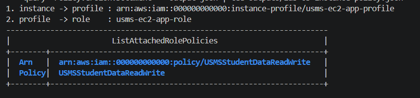
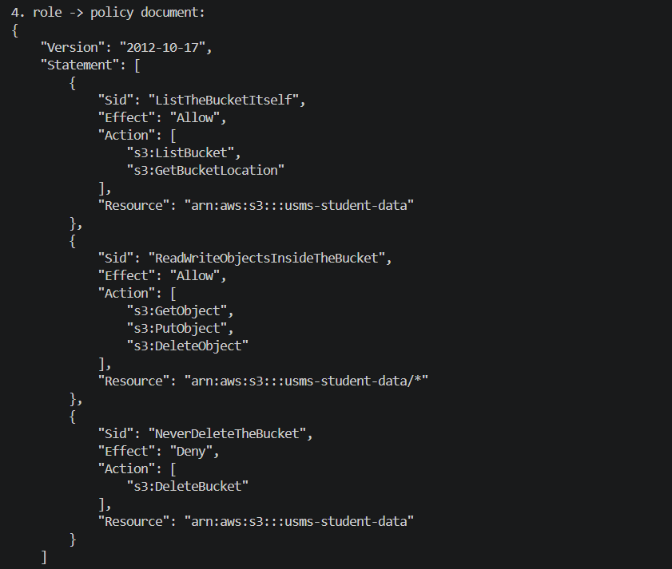

I proved the user data that Floci stored was byte identical to my script (1657 bytes each).

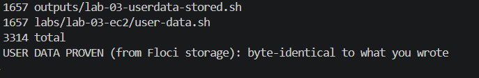

### Part C: Address, reachability and storage

I allocated the Elastic IP usms-web-eip and associated it with usms-web-01. I then tried the website with curl, which timed out as expected on Floci, so I checked the six configuration links a request needs instead.

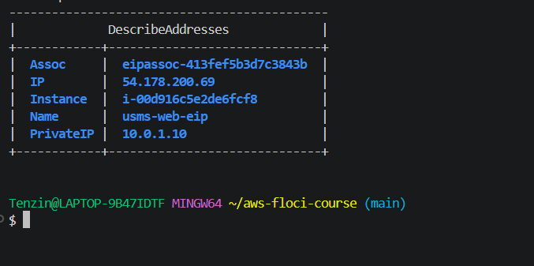
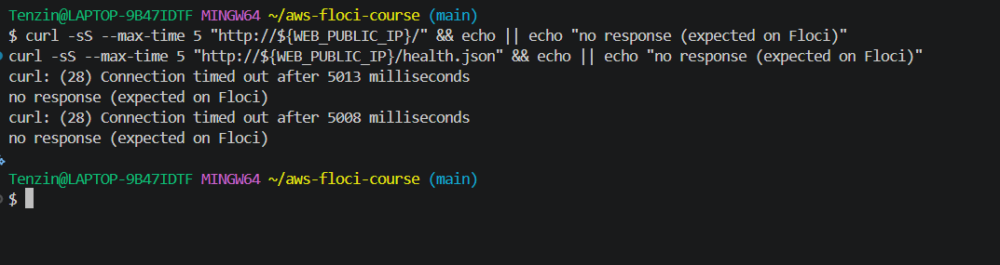
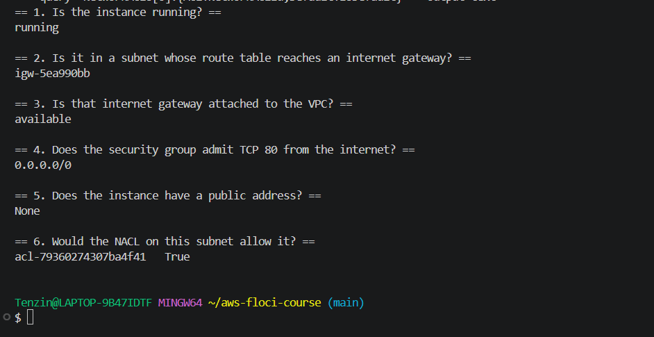

I created an 8 GiB gp3 data volume in the same Availability Zone as the instance and attached it as /dev/sdf. The root volume showed DeleteOnTermination True and my data volume showed False. I also tested the Availability Zone rule by trying to attach a volume from us-east-1b, which was refused, and then deleted that test volume.

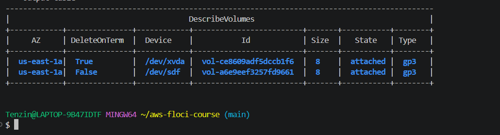
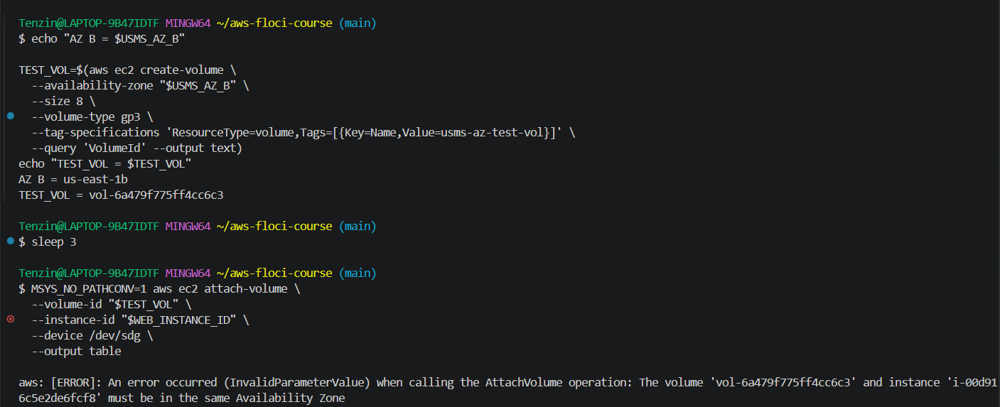

### Part D: The data tier, restarts and the golden AMI

I launched usms-db-01 into the private subnet with usms-db-sg and deliberately no instance profile. It had no public address, as expected.

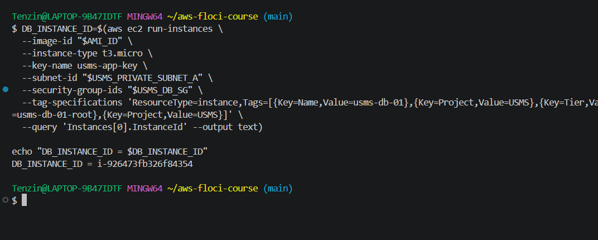
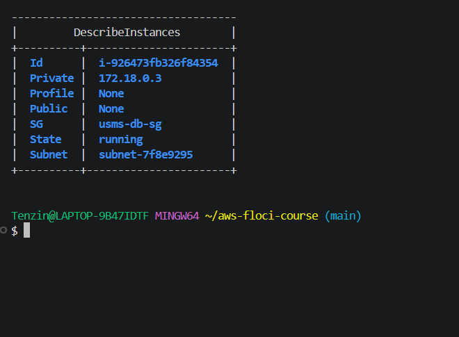

I read back the wiring between the two tiers. The private route table sends 0.0.0.0/0 only to the NAT gateway, so nothing on the internet can reach usms-db-01.

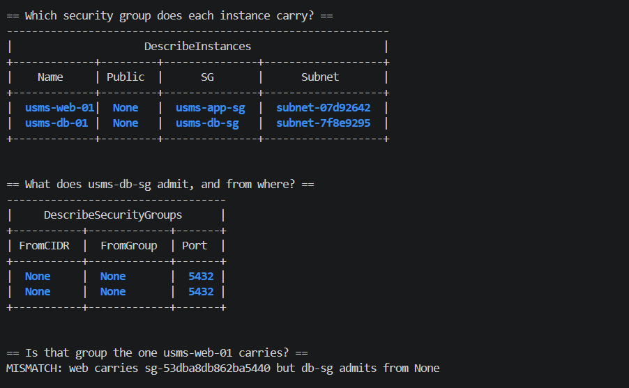
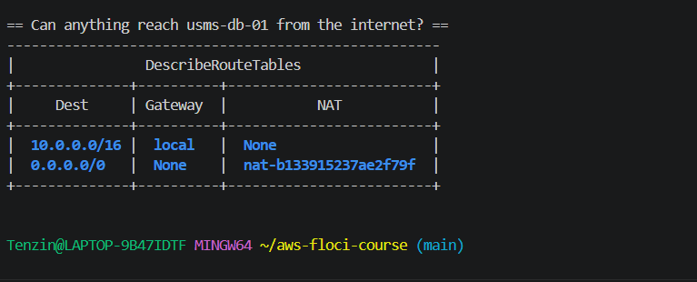

I stopped and started usms-web-01. The private IP stayed 10.0.1.10 and the Elastic IP stayed associated with the same association ID.

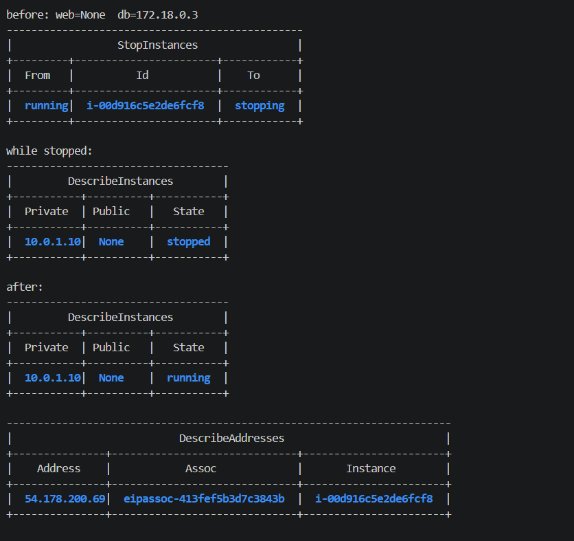

I recorded every running USMS instance with its subnet and security group, restarted Floci, and read them back by tag. After restarting usms-db-01, which Floci had marked as stopped, the comparison printed PERSISTENCE PROVEN.

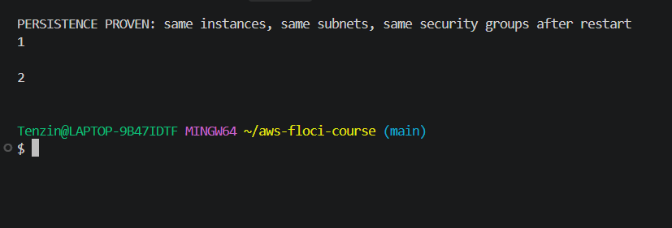

I created the golden AMI usms-web-golden-20261002 from usms-web-01 with --no-reboot, audited everything this lab created, and wrote configs/lab-03.env by looking each ID up instead of copying shell variables.

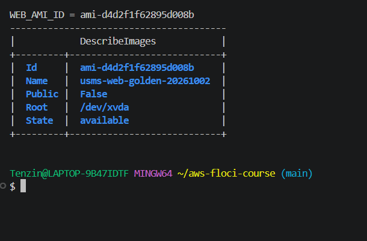
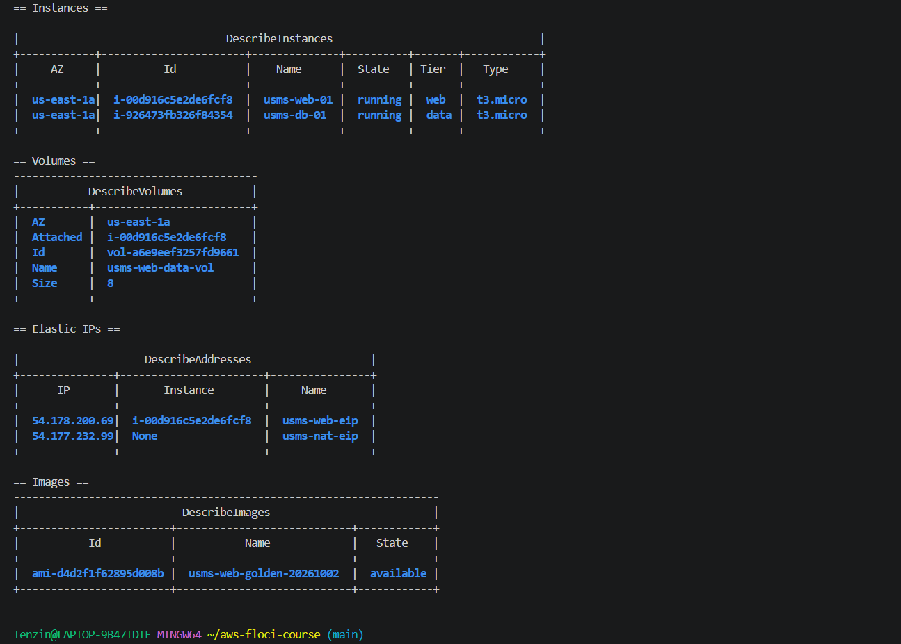
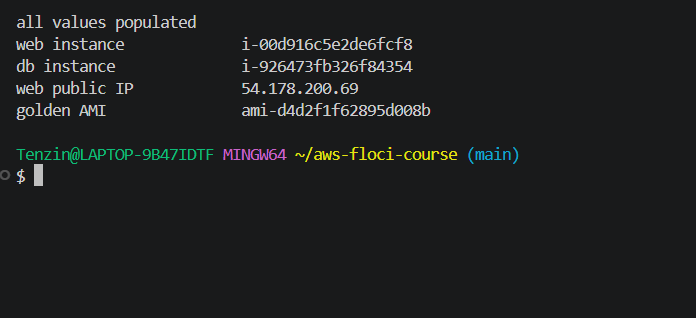

Finally I wrote verify-lab-03.sh, which checks 36 things, built the cleanup script without running it, and committed.

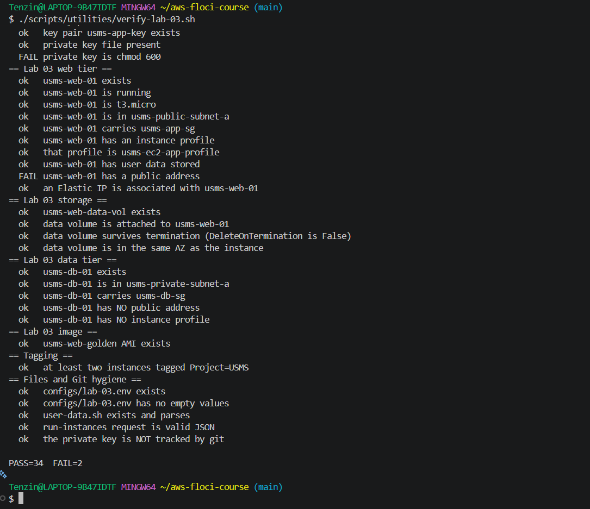
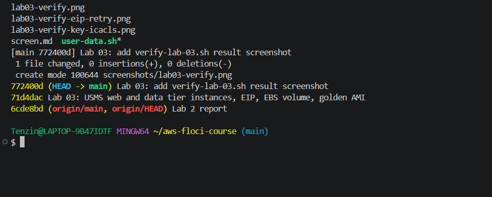

## 6. Results and Evidence

### 6.1 CLI / SDK Evidence

All screenshots are referenced in Section 5 above. The five independent exercises with their own evidence are in labs/lab-03-ec2/exercises.md, and the seven review questions are in notes/lab-03-notes.md.

### 6.2 AWS Management Console Verification

Like Labs 1 and 2, Floci has no graphical console, so all verification was done through the CLI and is shown in Section 5 and in exercises.md.

## 7. Analysis and Discussion

The configuration came out right everywhere: both tiers are in the correct subnets with the correct security groups, the permission chain reaches the right policy, the user data was stored exactly, the data volume survives termination, and everything survived a Floci restart. verify-lab-03.sh finished with PASS=34 FAIL=2. The lab expected FAIL=0, so here is what did not match and why.

**Floci limitations I hit:**

1. **Instance stuck in pending.** This Floci build runs each instance as a real Docker container, so the first launch had to download amazonlinux:2. The first download failed on the college network and the instance sat in pending for about 9 minutes. Later, switching networks restarted Floci, which killed the instance's container. Floci reloaded the instance from storage but never rebuilt the container, and a stop and start only changed the state label to running. On real AWS the AMI is already in the region and an instance is not affected by anything on my laptop.

   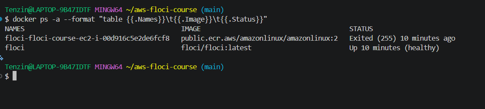

2. **User data not returned by the API.** describe-instance-attribute --attribute userData returned nothing on Floci. The script was saved in Floci's storage file, so I extracted it with jq and compared it with diff, which proved it was byte identical. On real AWS the API returns it base64 encoded.

3. **Public IP not shown.** After the stop and start the instance's PublicIpAddress was None, even though the subnet has auto assign public IP turned on. When I attached the Elastic IP, describe-addresses showed it linked to usms-web-01, but Floci never wrote it into the instance's own field. I tried reassociating it and rebuilding the container and neither worked. This is the "usms-web-01 has a public address" failure in the verify script, and the next check, that an Elastic IP is associated with usms-web-01, passes.

   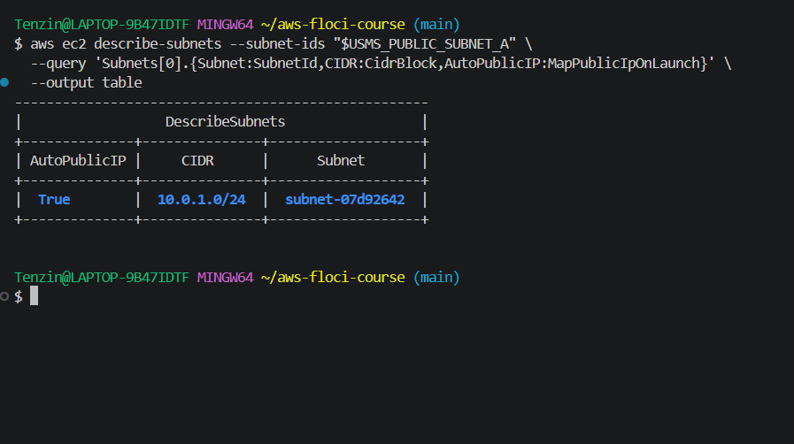
   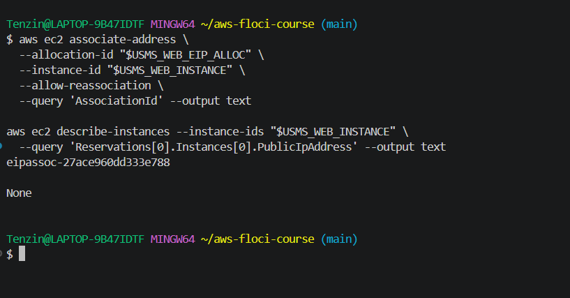

4. **Group referenced rule dropped.** usms-db-sg had the port 5432 rule but its source group was gone, the same bug I documented in Lab 2, so Step 17 printed MISMATCH instead of WIRING PROVEN. On real AWS the source would be usms-app-sg.

5. **Tags not applied at creation.** Floci ignored the volume tags in the launch request and the image tags in create-image. I added them with create-tags. Floci also ignored the tag filter on describe-images, returning my AMI even for a name that does not exist.

   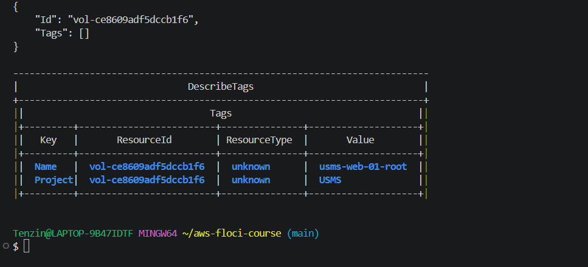
   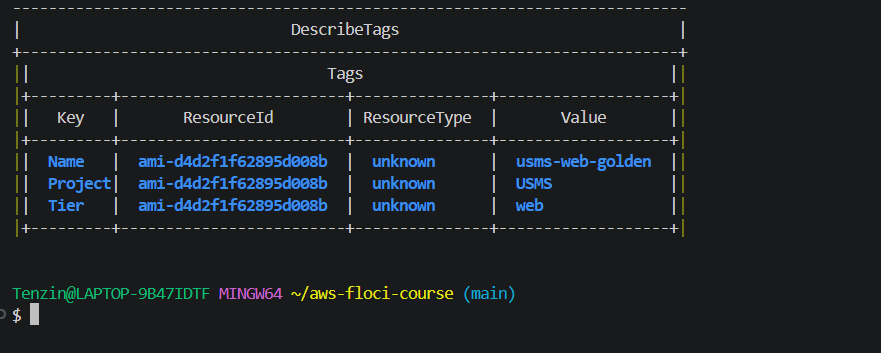

6. **Docker IP as private IP.** usms-db-01 got 172.18.0.3, which is the Docker container's address, instead of an address inside 10.0.3.0/24.

   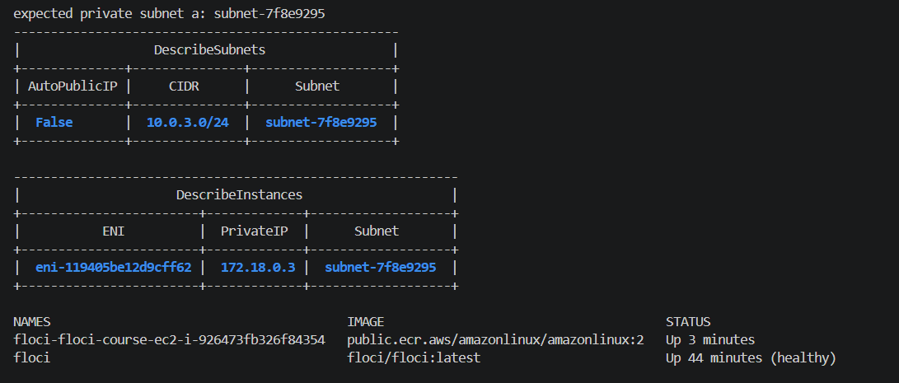

**Windows issues I hit and fixed:**

1. **Path conversion.** Git Bash turned /dev/sdf into C:/Program Files/Git/dev/sdf when attaching the volume. I detached it and attached it again with MSYS_NO_PATHCONV=1.

   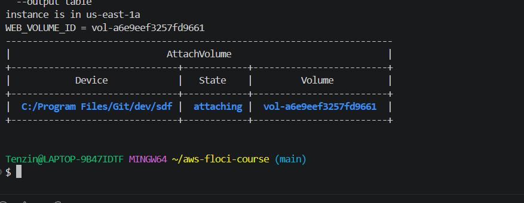
   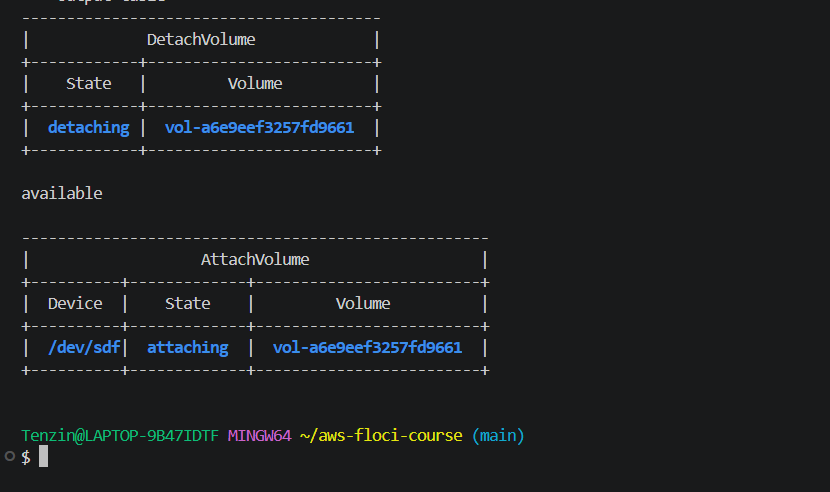

2. **Line endings.** jq and the AWS CLI on Windows add a hidden \r at the end of lines, which broke my first user data comparison and later my reachability script. I fixed both with tr -d '\r'.

3. **chmod 600.** Git Bash on NTFS always reports 644, so the verify check for the private key fails. I applied the Windows equivalent with icacls so only my user can read the key.

   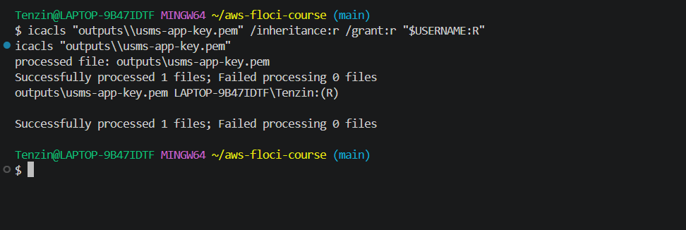

The main observation from this lab is the same lesson the lab keeps repeating: a command reporting success is not proof it did what I meant. Several commands here succeeded while Floci quietly did something different, and I only found out because I read every result back.

## 8. Reflection

**What did I learn about this AWS service?**
I learned that an EC2 instance is really a combination of separate pieces, and that most of what makes it secure or reachable is not on the instance itself. Its public reachability comes from the subnet's route table, its permissions come from the instance profile and the role behind it, and its durable storage is a separate volume with its own lifecycle. I also learned that user data only runs once, and that an Elastic IP is a resource I own separately from the instance, which is exactly what makes it useful when an instance fails.

**What challenges did I encounter?**
Most of my challenges came from Floci and from running on Windows rather than from EC2 concepts. The hardest part was the instance getting stuck after Floci restarted, because it looked like my work had broken when it had not. I learned to read Floci's own logs and its storage files to find the real cause instead of guessing, and to keep proof of each problem as I went.

**How would I apply this in a real world cloud environment?**
I would keep web servers in public subnets behind a load balancer and databases in private subnets with no public address, give instances roles through instance profiles instead of putting keys on them, and keep data on separate volumes with snapshots. From Exercise 4 I also learned that a t3 instance running hot all day costs more than it looks because of unlimited mode credits, and that scaling out with Auto Scaling usually fits a daytime workload better than one bigger instance.

**What additional concepts would I like to explore?**
I would like to try launch templates and Auto Scaling groups with the golden AMI, and Systems Manager Session Manager as a way to reach private instances without opening SSH at all.

## 9. Conclusion

This lab deployed USMS as a two tier application on EC2: a web server in the public subnet with an instance profile, user data, an Elastic IP and a separate data volume, and a database server in the private subnet with no public address and no profile. I created a golden AMI, wrote a verification script that checks 36 things, built a cleanup script without running it, and completed all five independent exercises. The objectives were achieved. The configuration is correct in every place I checked, and the two remaining verify failures are a Floci display limitation and a Windows file permission limitation, both explained with evidence. The main skills I built were combining resources from earlier labs in one launch, proving results instead of trusting them, and investigating tool problems properly instead of assuming my own work was wrong.

## 10. Appendix (Optional)

- GitHub repository: https://github.com/Eyemusican/dso303-lab01-iam
- Exercises with full evidence: labs/lab-03-ec2/exercises.md
- Review questions: notes/lab-03-notes.md
- User data scripts: labs/lab-03-ec2/user-data.sh, labs/lab-03-ec2/user-data-db.sh
- Launch request: templates/lab-03-run-instances.json
- Scripts: scripts/utilities/verify-lab-03.sh, scripts/utilities/lab-03-reachability.sh, scripts/cleanup/lab-03-cleanup.sh