# Lab 04 Exercises

## Exercise 1: A second service, deployed

I created usms-results-svc in usms-ecs-cluster from the same usms-enrolment task definition family, with a desired count of 1, in both private subnets, carrying usms-enrolment-sg. It uses the same blueprint as the enrolment service, just a lower floor.

To follow the rule that every ID is captured with $(...) and --query, I read the subnets and the security group straight from usms-enrolment-svc's own network configuration instead of typing them. That also guarantees both services use exactly the same subnets and security group.

I tagged it Project=USMS, Tier=app, Lab=04 and Service=results, and I did not add it to configs/lab-04.env because Exercise 4 removes it.

**Result:** describe-services returned two ACTIVE services, usms-enrolment-svc with desired 2 and usms-results-svc with desired 1. Both were actually running (2 and 1), because they use revision 3 with the working nginx:stable image. list-tags-for-resource showed all four required tags on the results service.

The verify script still passes, because it does not check for the absence of extra services.

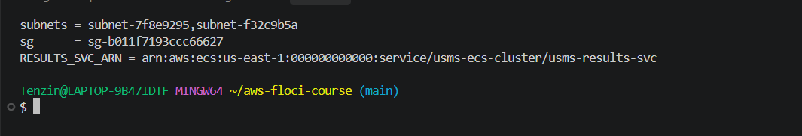
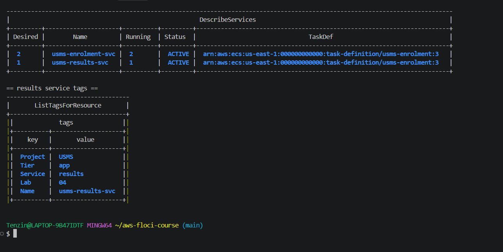

## Exercise 2: A new revision, and a deployment that does not drop traffic

The lab asks for usms-enrolment:2, but I already had revisions 1, 2 and 3 (revision 3 is the working nginx:stable image from Step 10), so my new revision is usms-enrolment:4.

To keep a copy of the template that produced the previous revision, I left templates/lab-04-taskdef-v3.json as it was and wrote a new file, templates/lab-04-taskdef-v4.json, with jq. The only changes are memory raised from 512 to 1024 MiB, which is still a valid pair with cpu 256, and a new environment variable USMS_LOG_LEVEL=info. I registered it as usms-enrolment:4.

I updated usms-enrolment-svc to usms-enrolment:4 and used the manual polling loop from Step 10 instead of a fixed sleep. It reached desired=2 running=2 on the first attempt.

**Result:** describe-services shows taskDefinition ending in :4 with 2 running. describe-task-definition for usms-enrolment:1 still succeeds and still reports ACTIVE with memory 512, because deregistering is a separate action this exercise does not take. list-tasks showed exactly 2 running tasks, both on revision 4.

**One sentence:** updating the service only changes its taskDefinition pointer to the new revision, while every existing revision, including the one it pointed to before, stays exactly as it was.

**Deployment order:** right after the update, docker ps still showed the two old revision 3 containers next to the two new revision 4 ones, while list-tasks already counted only the 2 new tasks. About a minute later the old containers were gone on their own. So ECS started the new tasks first and then stopped the old ones, which is how a rolling deployment avoids dropping traffic: there is never a moment with zero running tasks.

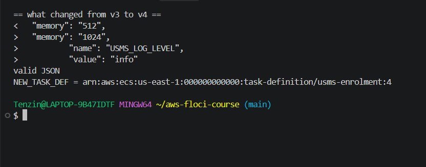
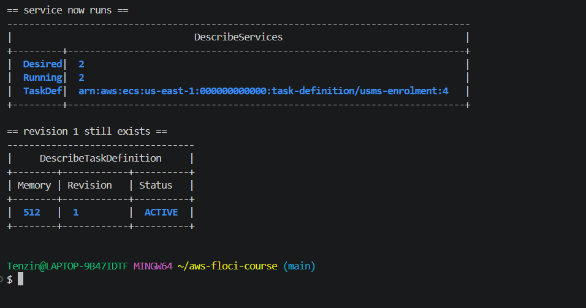
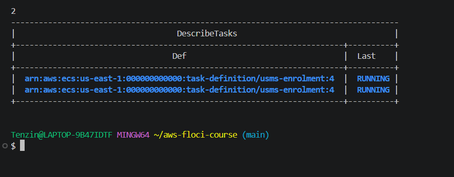

## Exercise 3: An ECS configuration drift report

I wrote scripts/utilities/lab-04-ecs-inventory.sh. It lists every service in usms-ecs-cluster with list-services, so there is no hard coded service name, then describes each service and its task definition and prints one line per service.

The verdicts are computed, never taken from a name or a tag:
- roles is SAME if executionRoleArn equals taskRoleArn, SEPARATE if they differ, and N/A if either is missing.
- publicip is RISK if assignPublicIp is ENABLED, OK if it is DISABLED, and N/A if the service has no networkConfiguration at all, for example an EC2 launch type service. So a service without network settings prints publicip=N/A instead of crashing.

The script uses set -uo pipefail but not set -e. Some lookups can return nothing on purpose, and with -e one empty lookup would stop the report halfway and silently hide every service after it. An inventory that quietly skips a risky service is worse than one that never ran, so every value is checked and missing data is printed as N/A.

It finds the repo root from ${BASH_SOURCE[0]}, so it works from any folder, and it also writes the same data as JSON to outputs/lab-04-ecs-inventory.json. Like my Lab 3 reachability script, it strips the hidden \r that jq adds on Windows from every result.

**Result:** usms-enrolment-svc (desired 2, running 2, usms-enrolment:4) and usms-results-svc (desired 1, running 1, usms-enrolment:3) both came out roles=SEPARATE and publicip=OK. The output was identical when I ran it from ~ and from labs/lab-04-ecs/. The JSON file is in outputs/, which is git ignored, so the screenshot is the evidence.

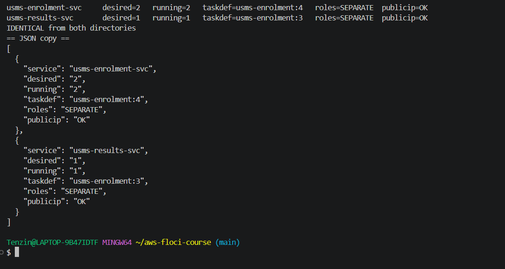

## Exercise 4: The enrolment week capacity plan

### Why a fixed desiredCount of 2 cannot answer the 08:03 problem
usms-enrolment-svc has no scalable target, no scaling policy and no scheduled action. Nothing in what this lab built reads a metric or a clock. The only way its capacity ever changes is a human running update-service, like I did by hand in the Step 11 "Your turn" task. So at 08:00 on enrolment Monday it still runs 2 tasks, the same as 3am on a Sunday in July. If 2 tasks cannot handle the first twenty minutes, it falls over, and nothing will add capacity until someone notices and runs a command, which matches last year's eleven minute outage.

### My assumptions (stated so they can be checked)
- 4,000 students register in the first 20 minutes (from the lab scenario).
- Each student makes about 10 requests (log in, browse modules, select, confirm). Assumption.
- Traffic is not even: the first minutes are the busiest, so I plan for 3 times the average. Assumption.
- One task (0.25 vCPU, 1 GB) handles about 10 requests per second. Assumption, to be measured with a load test before Lab 06.

### Deriving the numbers
- Total requests: 4,000 students x 10 = 40,000 requests in 20 minutes (1,200 seconds).
- Average: 40,000 / 1,200 = about 33 requests per second.
- Peak: 33 x 3 = about 100 requests per second.
- Tasks at peak: 100 / 10 per task = 10 tasks, plus 1 task of headroom per Availability Zone = 12 tasks.

### Proposed plan for whoever does Lab 06
- **Minimum 2:** one task in each of the two private subnets, so losing one Availability Zone does not take the service down. Too high wastes money every quiet hour of the year. Too low (1) means one AZ failure or one crashed task is a full outage.
- **Maximum 12:** the peak of 10 tasks plus 1 spare per AZ. Too high lets a bug or a bad metric scale up and run up a bill. Too low caps the service below the peak and we fall over again at 08:03.
- **Scheduled floor of 10 from Monday 07:30 to 09:00 in enrolment week:** a new Fargate task takes 20 to 60 seconds to start, and a CPU based policy also needs a minute or more of high CPU before it reacts. That is too slow for a spike that starts at exactly 08:00, so the capacity has to be there before the doors open. Too high just costs a little extra for 90 minutes. Too low and the first few minutes still overload while scaling catches up.
- **Outside that window, target tracking on CPU around 60 percent**, between 2 and 12, so unexpected busy periods still get capacity. Too high a target leaves no buffer for spikes. Too low keeps extra tasks running for no reason.

Note: my Step 3 probe showed this Floci build does not support scheduled actions, so Lab 06 will need its fallback for the scheduled floor.

### Monthly cost comparison
Prices (Linux x86, us-east-1, on demand): $0.04048 per vCPU hour and $0.004445 per GB hour, from the AWS Fargate pricing figures quoted by usage.ai's EC2 vs Fargate guide (official page: https://aws.amazon.com/fargate/pricing/). A month is 730 hours.

One task (0.25 vCPU, 1 GB) per hour: 0.25 x 0.04048 + 1 x 0.004445 = $0.014565. Per month: 0.014565 x 730 = $10.63.

| Option | Calculation | Per month |
| --- | --- | --- |
| Fixed at today's 2 | 2 x $10.63 | $21.27 |
| Fixed at peak 12 | 12 x $10.63 | $127.60 |
| Scheduled: 2 all month, plus 8 extra for 1.5 hours | $21.27 + (8 x 1.5 x $0.014565 = $0.17) | about $21.44 |

Fixed at 2 is cheap but falls over at 08:03. Fixed at 12 survives enrolment but pays for 10 idle tasks at 3am every Sunday, about $106 a month wasted. The scheduled plan costs almost the same as today and still has the capacity in place when it is needed.

### What to switch off
The Exercise 1 results service, usms-results-svc. The commands and the danger note are below, and I ran only this deletion.

**What will be deleted:** usms-results-svc only, and its one task.
**What depends on it:** nothing. It is not in configs/lab-04.env, and Labs 5 and 6 use usms-enrolment-svc.
**Reversible:** no, but it can be recreated from the same task definition with one create-service call.
**Effect on later labs:** none. It is not in the KEEP column.

Dependency order: scale the service to 0 first and wait until runningCount is 0, then delete it, so tasks drain normally instead of being killed with --force.

    aws ecs update-service --cluster usms-ecs-cluster --service usms-results-svc --desired-count 0
    aws ecs delete-service --cluster usms-ecs-cluster --service usms-results-svc

runningCount reached 0 on the third check, delete-service returned INACTIVE, and list-services showed only usms-enrolment-svc. Afterwards verify-lab-04.sh still reported PASS=38 FAIL=0.

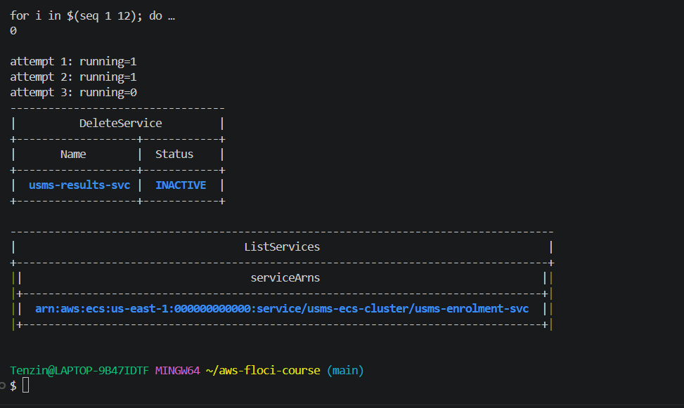
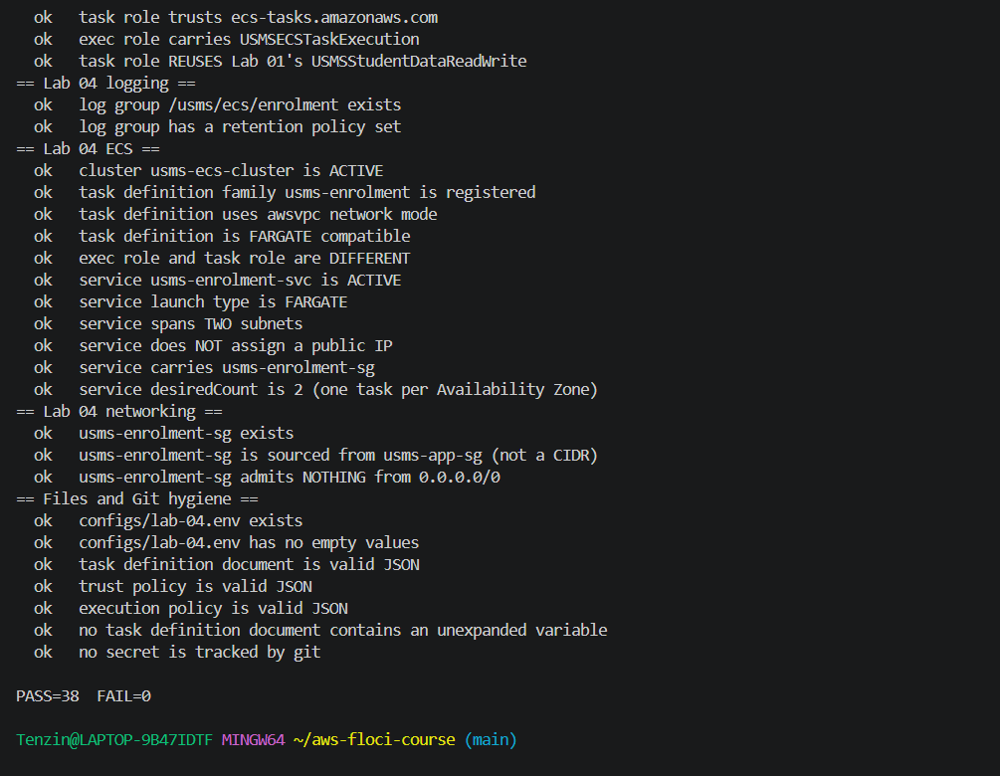

## Exercise 5: Close the loop back to Lab 3, and hand Lab 05 what it needs

usms-enrolment-sg has one inbound rule, tcp 80 from the group sg-53dba8db862ba5440 (usms-app-sg). I resolved that group back to the instance that carries it, so the rule is shown to point at something real.

**The reverse lookup:** I ran describe-instances with the filter instance.group-id=sg-53dba8db862ba5440. It returned usms-web-01, usms-db-01 and usms-db-02. That looked like a mismatch, so I checked instead of accepting it. Reading each running instance's own SecurityGroups showed only usms-web-01 carries usms-app-sg, while usms-db-01 and usms-db-02 carry usms-db-sg, as Lab 3 set them up. I then ran the same filter with a group that does not exist, sg-00000000000000000, and it still returned all three instances. So Floci ignores the instance.group-id filter, the same kind of gap as the image tag filter in Lab 3 Step 20. I computed the match from the real SecurityGroups lists instead.

**Result:** the group resolves to exactly one instance, i-00d916c5e2de6fcf8, which matches USMS_WEB_INSTANCE in configs/lab-03.env. Verdict: LOOP CLOSED.

**The linkage file:** I wrote outputs/lab-04-lab03-linkage.txt with the source group, the instance it resolves to, the LOOP CLOSED verdict, a note on the Floci filter, and the sentence that this rule is temporary because Lab 05 removes it once the load balancer becomes the only caller. outputs/ is git ignored, and the lab expects a committed file, so I also committed a copy at [lab-04-lab03-linkage.txt](lab-04-lab03-linkage.txt). It contains IDs only, no secrets.

**Tag audit:** I ran aws ecs list-tags-for-resource against the cluster ARN and the service ARN from configs/lab-04.env (this call takes an ARN, not a name, unlike most ECS calls in this lab) and appended the result to the file. The cluster has Name, Project=USMS and Tier=app, and the service has Name, Project=USMS, Tier=app and Lab=04. This Floci build stored the tags from create-cluster and create-service, so nothing needed fixing with tag-resource.

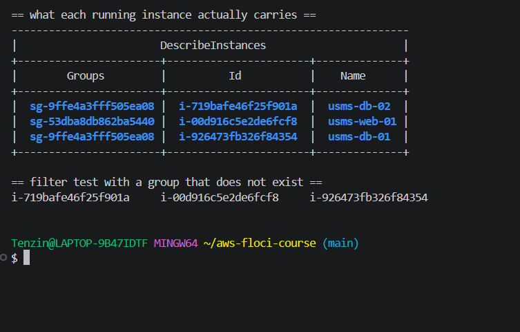
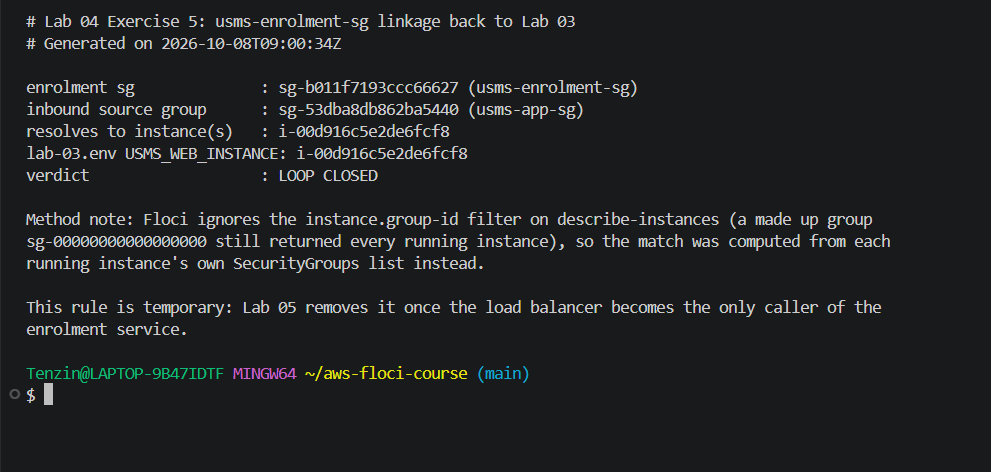
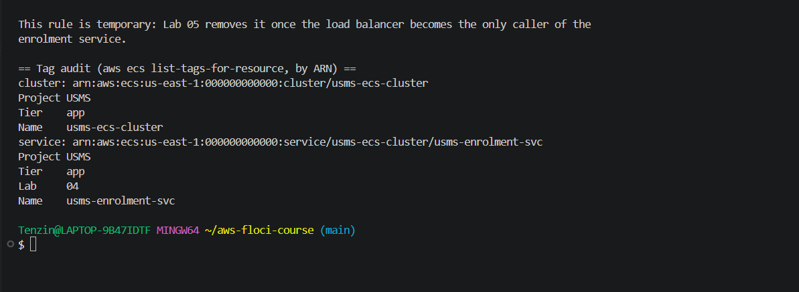