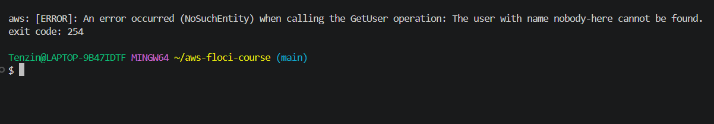
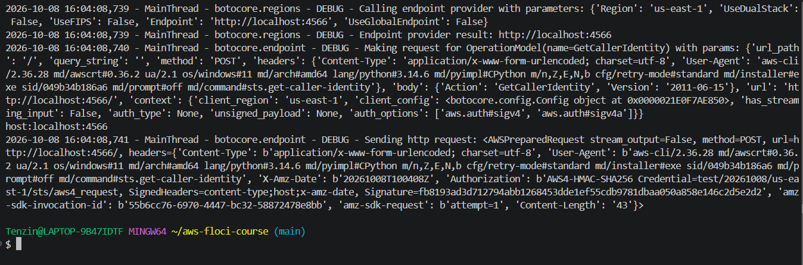
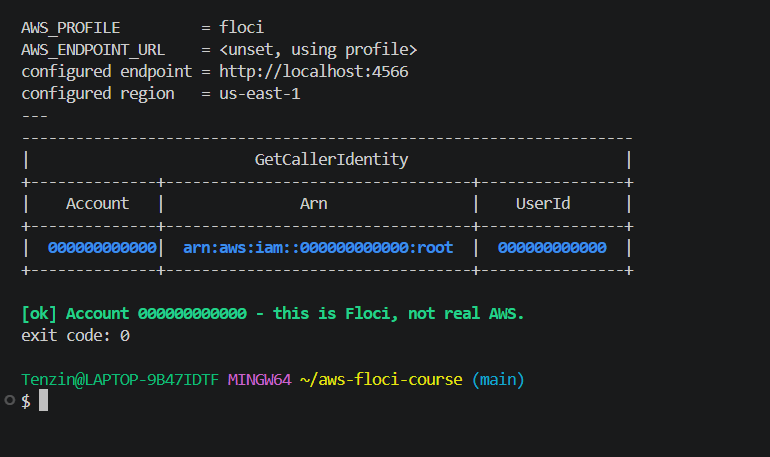
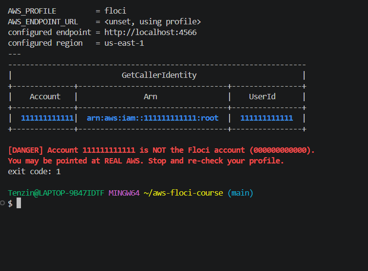

# Lab 01 Notes

## Exercise 4 — Backup operator design decision

I went with a role for the backup operator, not a user or group, since this is an automated nightly job with nobody typing commands. A role only hands out temporary credentials when the job actually runs, so there's no permanent access key sitting on a server or inside a script that could leak. Same reasoning as usms-ec2-app-role in Step 28, a role is the right call whenever a service or scheduled process needs to act, not a person.

### Three ways this policy could still be abused

1. The archive bucket could be used to move data out. The role can copy anything from usms-student-data into usms-archive, so if the archive bucket itself is readable by anything outside this role's intended use, student data effectively leaves its controlled location. I would close this by putting a bucket policy on usms-archive that only allows access from this specific role.

2. The logging permission covers the whole log group, not one stream. If another process also had write access to the same log group, it could write fake completion log entries that look like they came from the backup job. I would close this by giving each run its own timestamped log stream and scoping the policy tighter, or adding a Condition on logs:PutLogEvents that checks the stream name pattern.

3. The trust policy trusts all of ec2.amazonaws.com, so any EC2 instance profile in the account could assume this role, not just the one running the actual backup job. I would close this with a Condition on the trust policy using aws:SourceArn to restrict which specific instance or instance profile is allowed to assume it.

## Review Questions

### 1. Trust vs permissions
What is almost certainly missing is the trust side. The permissions policy only says what the role can do once someone is using it. The trust policy says who is allowed to become the role in the first place. Every role has a trust policy, but if it does not name the caller as a principal, nobody can assume the role, so the perfect permissions are never used. There is also a second half on the caller's side: the user needs its own permission to call sts:AssumeRole on that role ARN. I set up both halves in Step 30. trust-account-developers.json names usms-dev-01 as the principal, and I attached USMSAssumeAppRoles to usms-developers so the caller was allowed to ask. IAM keeps the two documents separate because they answer different questions. Who may use usms-ec2-app-role (ec2.amazonaws.com) has nothing to do with what it may do (USMSStudentDataReadWrite), so I can change one without touching the other, and they can be owned by different people.

### 2. Explicit vs implicit deny
Both calls fail with AccessDenied, but for different reasons. iam:CreateUser is an explicit deny. USMSDeveloperBase reaches usms-dev-01 through usms-developers, and its DenyDangerousIdentityChanges statement names iam:CreateUser with Effect Deny. dynamodb:PutItem is an implicit deny. No policy on usms-dev-01 or its group mentions DynamoDB at all, so the request falls through to the default deny. To tell them apart I would run `aws iam simulate-principal-policy` for both actions. The first comes back as explicitDeny with the matching statement listed, and the second as implicitDeny with no matching statement. On real AWS the error message also says it, either "with an explicit deny in an identity based policy" or "because no identity based policy allows" the action. The fix is different because an explicit deny always wins. For DynamoDB I just add an Allow for the exact action and table ARN. For CreateUser no Allow anywhere can override the Deny, so the only fix is to change or remove the Deny statement. Since that guardrail is there on purpose, the right answer is probably to leave it and have an admin create the user.

### 3. Roles over keys
First, the credentials are temporary. When usms-web-01 uses usms-ec2-app-role through usms-ec2-app-profile, it gets ASIA credentials with a session token, and AWS expires and rotates them on its own. usms-dev-01's key is an AKIA key that stays valid until someone deletes it, so a leaked copy keeps working. Second, there is no secret to store. A key in a configuration file can end up in Git, a backup, a container image or a screenshot. I saw how hard a key file is to protect in Step 31: I redirected the key straight into outputs/ and relied on .gitignore, because chmod 600 did nothing on NTFS. I even captured a SecretAccessKey and SessionToken in my first Exercise 3 screenshot and had to retake it, and the only reason that was not serious is that those credentials were temporary and had already expired. With a role there is no key file at all.

### 4. The S3 ARN trap
s3:ListBucket is a bucket level action, so its Resource is the bucket ARN, arn:aws:s3:::usms-student-data. s3:GetObject is an object level action, and every object has its own ARN with the key after a slash, like arn:aws:s3:::usms-student-data/transcripts/file.pdf. A Resource of only the bucket ARN never matches any object ARN, so GetObject is never allowed and downloads fail, even though listing the bucket works. The corrected policy needs two Resource values: arn:aws:s3:::usms-student-data for s3:ListBucket, and arn:aws:s3:::usms-student-data/* for s3:GetObject. That is how I wrote USMSStudentDataReadWrite in Step 23, with ListTheBucketItself on the bucket ARN and ReadWriteObjectsInsideTheBucket on the /* ARN.

### 5. The Floci illusion
Floci stores my policies and checks that the JSON is valid, but by default it does not check requests against them. It accepts any credentials that are not empty, so a command succeeding only proves the policy was saved, not that it allows or blocks the right things. I saw this in Step 32. I predicted ec2:CreateVpc would be implicitDeny for an identity with only ReadOnlyAccess, but the simulator said allowed, which real AWS would never do. Two techniques I would use before deploying to a real account: first, validate the policy with IAM Access Analyzer (`aws accessanalyzer validate-policy`), which flags errors, wildcards that are too broad and security warnings before I attach anything. Second, test it in a separate sandbox AWS account with a test identity, in both directions: run the actions the policy should allow and confirm they work, then run actions it should block and confirm they return AccessDenied. On a real account the policy simulator is also trustworthy for this, unlike on Floci.

### 6. The persistence trap
There are three independent reasons. First, a directory is not a mode. --persist only mounts a host directory at /app/data and does not change FLOCI_STORAGE_MODE, which defaults to memory. In memory mode Floci keeps everything in RAM, writes almost nothing to the directory and deletes its own volumes on teardown, so the directory existing proves nothing. Second, sidecar services like RDS, Lambda and ECS do not use --persist at all. They need FLOCI_STORAGE_HOST_PERSISTENT_PATH set to an absolute path, because ~ is never expanded. Third, CLI flags are not remembered. A Docker Desktop restart, a floci restart or a plain floci start brings the container back on defaults, memory mode with no mount, and one overnight restart wipes everything without a warning. The single test is the one I did in Step 14: create a marker user, restart the container and look the user up again with `aws iam get-user`. If it comes back, the data persisted. If it says NoSuchEntity, it did not. Checking get-caller-identity after a restart does not count, because the root ARN is the same even in memory mode. My persistence check user came back after a full restart, and ~/floci-data had real files in it.

### 7. Configuration as evidence
Because docker-compose.yml is committed, my setup is a file anyone can read instead of flags I typed once and forgot, and that is what makes it reproducible and safer. Every restart, and every person who clones the repo, gets the same container with FLOCI_STORAGE_MODE set to hybrid, the same bind mount for the data folder and the same port 4566, so nothing drifts between runs. It also holds no credentials, it stops with an error through ${FLOCI_HOST_DATA_DIR:?...} if the data path is missing instead of quietly starting with no storage, and container_name floci makes a stray floci start fail loudly instead of creating an empty second container. From my repository an instructor or a colleague can check exactly which storage mode, mount and settings I ran with, and see in Git history when they changed. From a command I typed they could check none of that, because it left no record.

## Attached vs inline policies

An attached policy is a managed policy with its own ARN. It exists on its own and can be attached to many identities. USMSDeveloperBase is one: I attached it to both usms-developers and usms-admins, and when I made v2 and v3 the change reached both groups at once. An inline policy is embedded inside one identity. It has no ARN, cannot be attached anywhere else and is deleted automatically when that identity is deleted. My example is USMSSelfManageCredentials, which I put on usms-dev-01 with put-user-policy in Step 25. It only makes sense for that one user, and it uses ${aws:username} so it can only touch that user's own keys and password. The two kinds are listed by different commands. list-user-policies for usms-dev-01 shows USMSSelfManageCredentials, while list-attached-user-policies returns an empty list, because usms-dev-01 gets its managed policies through usms-developers, not directly.

## Access key rotation

A user can hold two access keys at once, and that is what makes rotation possible without downtime. The five steps are:

1. Create a second access key for the user.
2. Deploy the new key everywhere the old one is used.
3. Set the old key to Inactive with aws iam update-access-key and --status Inactive.
4. Wait and watch for anything that breaks. If something fails, reactivate the old key straight away.
5. Only then delete the old key.

Making the old key Inactive before deleting it is the important part, because Inactive can be undone and delete cannot. For usms-dev-01 this would mean creating a second key next to the one in outputs/, switching the usms-dev profile to it, and only deleting the old key once nothing complains.

## Snapshot

I saved a snapshot of my Floci data at the end of Lab 1 with the tar fallback, as ~/floci-data-lab-01.tar.gz (9.0K, 21 August). It is a copy of my whole floci-data folder, so I keep it outside the repository on purpose, next to the data it backs up.

## sts:ExternalId (Exercise 3)

On sts:ExternalId, I would add one for a real external partner. Without it, anything that discovers the role ARN and holds usms-audit-01's credentials could assume it. An ExternalId is a shared secret the partner must also supply, protecting against the confused deputy problem where a third party gets tricked into assuming a role on someone else's behalf. In this exercise the trusted principal is my own usms-audit-01 user, so I left it out, but for the real partner university I would add a Condition on sts:ExternalId to the trust policy.

## Checking an exit code with $?

$? holds the exit code of the last command. 0 means success and anything else means failure. AWS CLI v2 uses 254 for a service error, like a user that does not exist, and 255 for a client or connection error. I ran aws iam get-user for a user called nobody-here and printed $? straight after. Floci returned NoSuchEntity and the exit code was 254. This is what my verify scripts rely on: they run a check and decide PASS or FAIL from its exit code, not from reading the text.

## Proving the CLI talks to Floci with --debug

The account number 000000000000 already shows I am not on a real AWS account, but --debug shows where the request actually goes. I ran sts get-caller-identity with --debug and filtered the output for the endpoint lines. The endpoint provider result was http://localhost:4566, and the request was sent to http://localhost:4566/, not to an amazonaws.com address.

The other isolation test in Step 14 is stopping Floci. With the container stopped, the same get-caller-identity fails with Could not connect to the endpoint URL "http://localhost:4566/". If my commands were secretly reaching real AWS, stopping a local container could not break them, so the failure is the proof. I did this in Step 14 before the persistence test, which starts from Floci being stopped.

## whoami.sh fails loudly on a wrong account

My first whoami.sh was a three line script that only ran get-caller-identity. It never checked the account, so it would have printed a real AWS account just as happily as Floci. I replaced it with the lab's Step 13 version. It prints the profile, endpoint and region, then compares the account with ACCOUNT_ID from configs/course.env, and exits with 1 and a red DANGER message if they differ.

On a normal run it shows account 000000000000, the green [ok] line and exit code 0.

To prove it fails loudly I ran it once with a fake access key ID, 111111111111, set only for that one command. Floci reports a 12 digit access key ID as the account number, so the script saw account 111111111111, printed DANGER and the warning that I may be pointed at real AWS, and exited with code 1.

